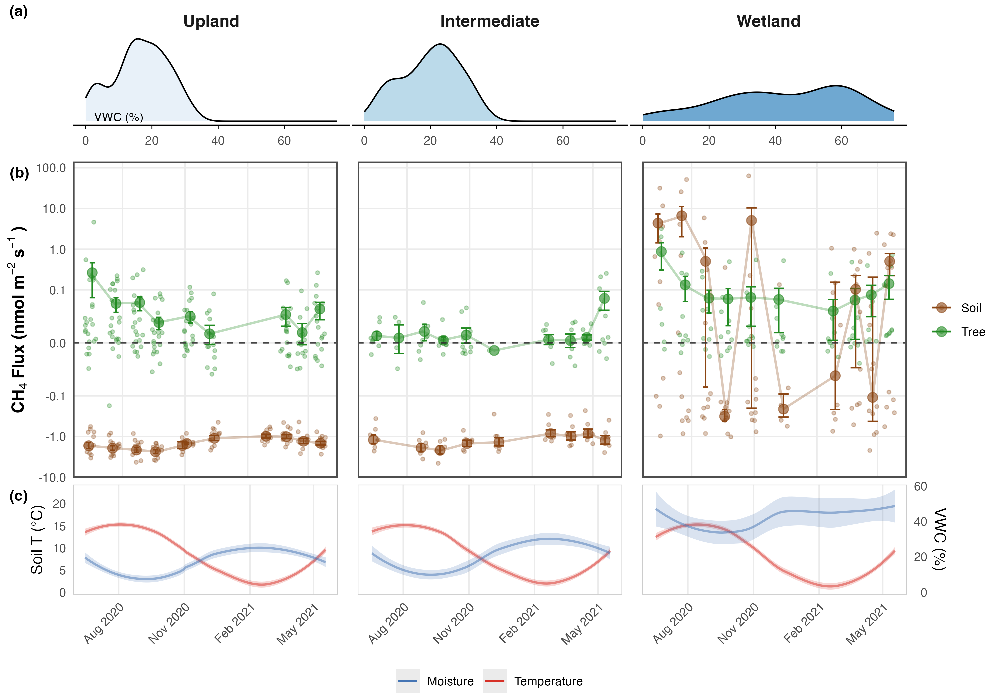
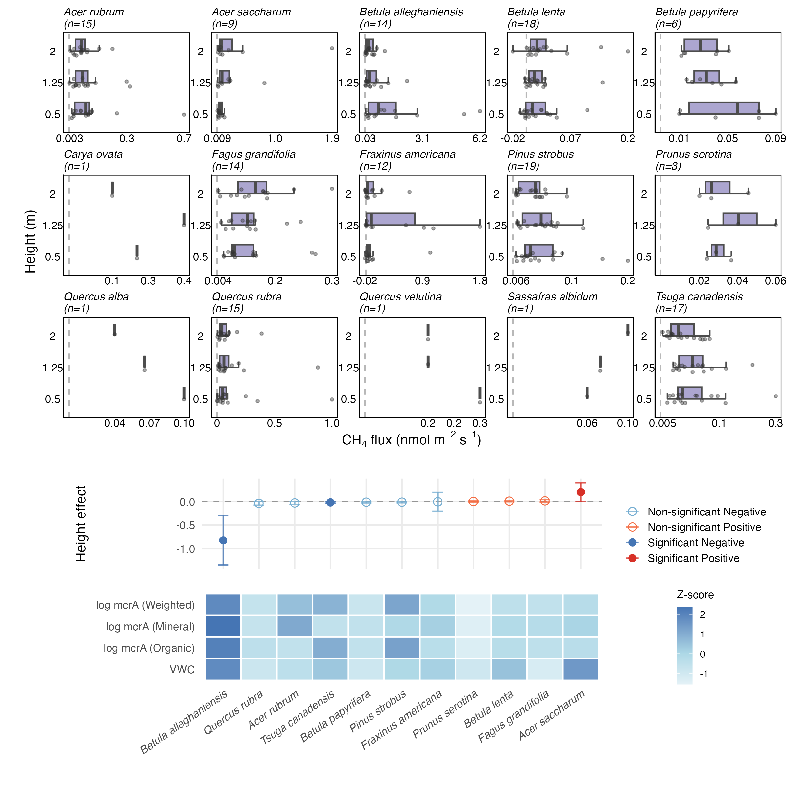
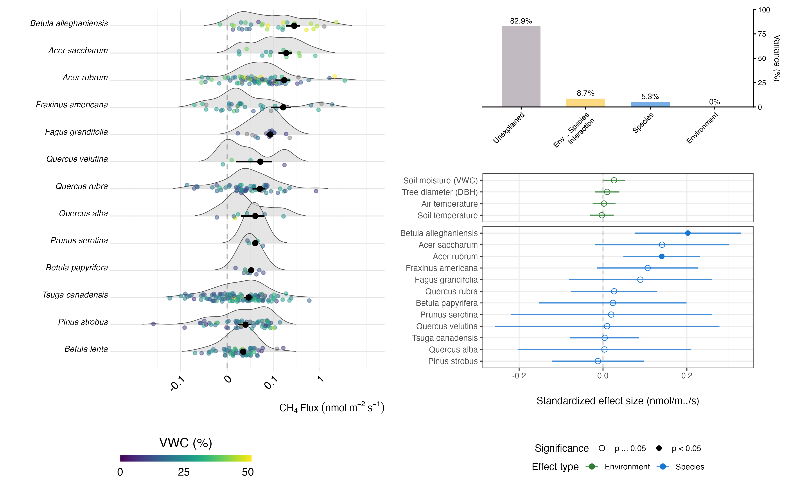
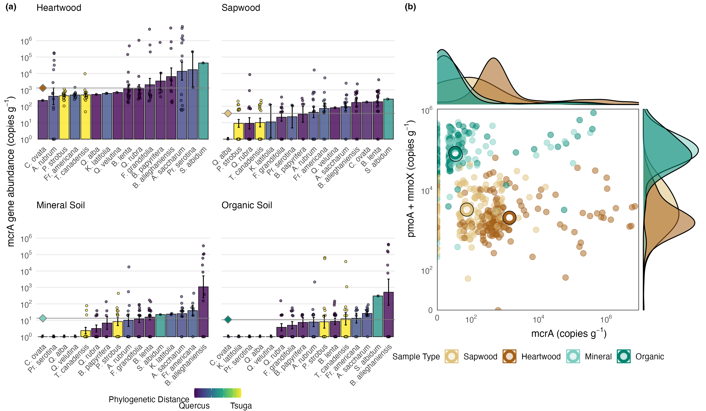
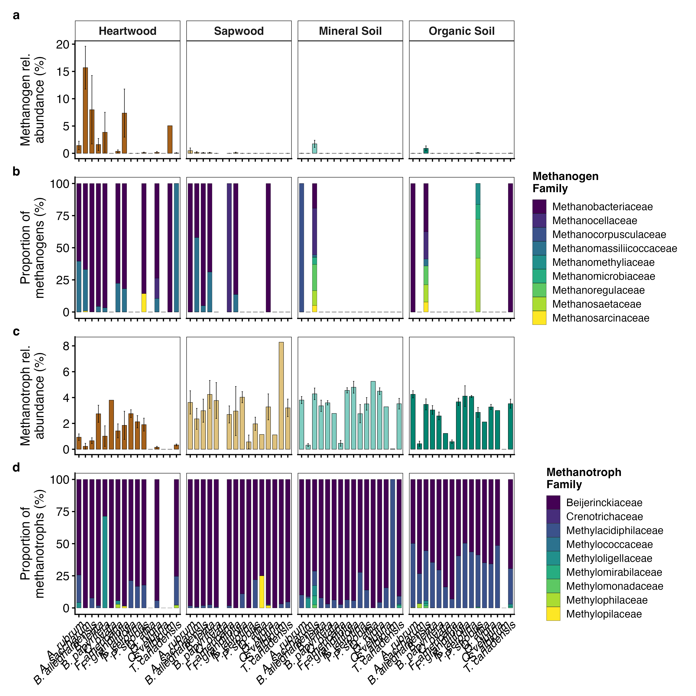
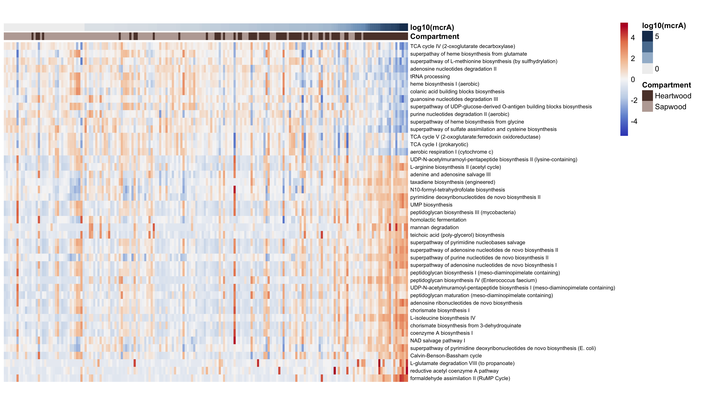
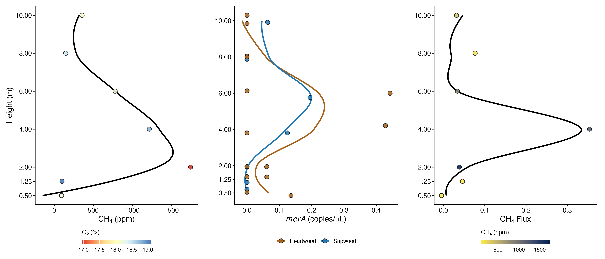
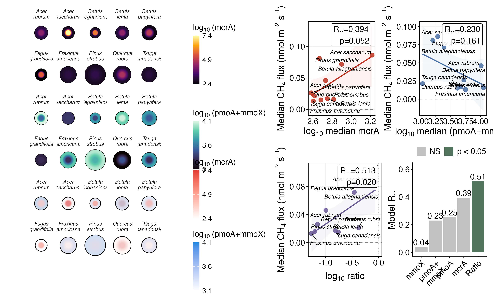
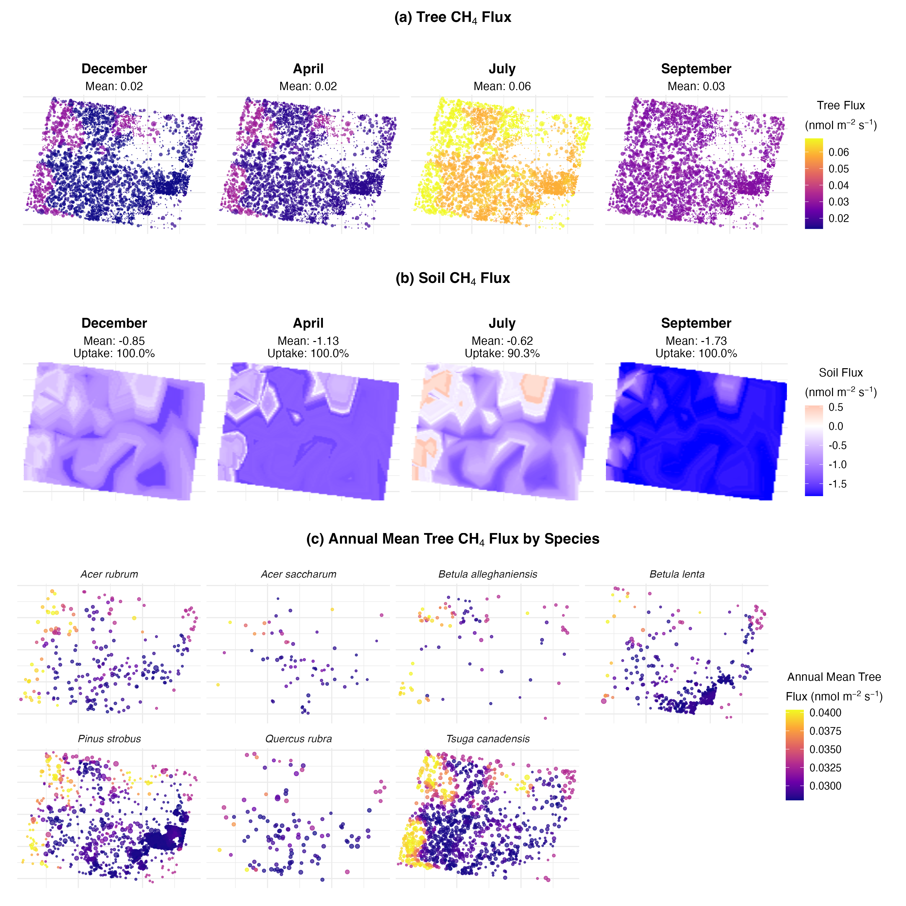

*For submission to New Phytologist*

# Tree microbiomes and methane exchange in upland forests

Jonathan Gewirtzman¹˒†˒*, Wyatt Arnold²˒†, Meghan Taylor¹˒³, Hannah Burrows⁴, Carter Merenstein⁵, David Woodbury⁶, Naomi Whitlock⁷, Kendall Kraut⁷, Leslie Gonzalez⁸, Craig R. Brodersen¹˒⁹, Marlyse Duguid¹˒⁹, Peter A. Raymond¹˒¹⁰, Jordan Peccia², Mark A. Bradford⁹˒¹⁰

¹ Yale School of the Environment, Yale University, New Haven, CT, USA

² Department of Chemical and Environmental Engineering, School of Engineering and Applied Science, Yale University, New Haven, CT, USA

³ WCRP Climate and the Cryosphere, University of Massachusetts, Amherst, Amherst, MA, USA

⁴ Harvard T.H. Chan School of Public Health, Boston, MA, USA

⁵ Harvard College, Harvard University, Boston, MA, USA

⁶ New Mexico Highlands University, Department of Forestry, Las Vegas, NM, USA

⁷ Wesleyan University, Middletown, CT, USA

⁸ Yale College, Yale University, New Haven, CT, 06511

⁹ The Forest School, Yale School of the Environment, Yale University, New Haven, CT, USA

¹⁰ Yale Center for Natural Carbon Capture, Yale University, New Haven, CT, USA

† Contributed equally to this work

* Corresponding author: jonathan.gewirtzman@yale.edu | ORCID: 0000-0003-3959-3758

**Word counts:** Introduction 750; Materials and Methods 1,696; Results 2,563; Discussion 1,980; Conclusions 190. Total body: 7,179 words. 9 Figures (all colour), 0 Tables. Supporting Information: 3 SI Methods sections, 17 SI Figures.

## Summary

-   **Rationale:** Upland forest trees emit methane (CH₄), but whether emissions derive from internal microbial production or soil-derived transport remains debated. Methanogens have been detected in heartwood of several species, yet the prevalence of wood-associated methanogenesis, its metabolic basis, and its relationship to co-occurring methanotrophy are poorly understood.

-   **Methods:** We measured 1,148 stem fluxes and 276 soil fluxes, sampled internal stem gases including δ¹³CH₄, quantified methanogens and methanotrophs via ddPCR in 564 samples, characterized communities via 16S rRNA sequencing, and upscaled fluxes.

-   **Key Results:** Methanogens were detected in 97% of heartwood samples (up to 10⁷ copies g⁻¹) at concentrations exceeding soil by ~2 orders of magnitude; methanotrophs were near-ubiquitous across all compartments. Wood harbored distinct communities dominated by hydrogenotrophic Methanobacteriaceae, corroborated by depleted δ¹³CH₄. Vertical flux profiles were uniform across height for most species, consistent with internal production; height-dependent declines occurred only in wet microsites. Species-level methanogen:methanotroph ratios predicted emissions (R² = 0.51), indicating net flux reflects the balance between production and oxidation.

-   **Main Conclusion:** Internal methanogenesis contributes widely to upland tree methane emissions, with net flux governed by the species-level balance between production and consumption. Resolving ecosystem-scale magnitude requires improved quantification of woody surface area and vertical flux variability.

**Keywords:** forest carbon cycle; global methane budget; greenhouse gas; heartwood; methanogen; methanotroph; methane emissions; temperate forest; tree microbiome

## Introduction

Forests are key regulators of the global methane (CH₄) cycle, functioning as both sinks and sources of this potent greenhouse gas. Methane contributes significantly to climate change, possessing a global warming potential more than 80 times greater than carbon dioxide (CO₂) over a 20-year period (Wood et al. 2023; Forster et al. 2021). While the role of soil in forest methane cycling has been extensively studied, emerging evidence reveals that trees themselves participate in the CH₄ cycle through several concurrent pathways, including internal microbial methanogenesis, transport of soil-produced CH₄, and oxidation by methanotrophic bacteria colonising bark and woody surfaces (Barba et al., 2019; Covey & Megonigal 2019; Gauci et al. 2024; Gauci, 2025).

Tree-mediated methane emissions vary considerably across species, landscapes, and temporal scales. In wetland forests, trees primarily act as conduits for soil-derived methane transported through vascular pathways (Pangala et al. 2013; Pangala et al. 2015; Pangala et al. 2017; Pitz et al. 2018; Jeffrey et al. 2023; Jeffrey et al. 2019). Upland forests, where well-drained soils are traditionally methane sinks, also have trees that emit methane (Machacova et al. 2023; Bréchet et al. 2025; Epron et al. 2022; Hettwer et al. 2025; Pitz & Megonigal 2017; Warner et al. 2017; Covey & Megonigal 2019), suggesting internal production rather than soil transport. Recent detections of endophytic methanogens support this hypothesis (Yip et al. 2019; Feng et al. 2022; Harada et al. 2024), but factors governing production remain poorly understood.

Methanogens (microbes which generate methane from hydrogenotrophic, acetoclastic, or methylotrophic methanogenesis, generally in anaerobic environments; Le Mer & Roger 2001) have been detected in heartwood of multiple species (Zeikus & Ward 1974; Zeikus & Henning 1975; Covey et al. 2012; Yip et al. 2019; Flanagan et al. 2021; Feng et al. 2022; Moisan et al. 2025; Harada et al. 2024; Mochidome et al. 2025). Anaerobic conditions in heartwood (Schink & Ward 1984; Shigo & Hillis 1973; Jensen 1967; Arnold and Gewirtzman et al. 2025), where oxygen diffusion is restricted, may create suitable methanogenic niches (Uroz et al. 2016; Mieszkin et al. 2021). Yet the extent of methanogen colonization, the metabolic processes, and the overall contribution to forest methane budgets remain unclear (Putkinen et al. 2021; Barba et al. 2024; Barba, Bradford, et al. 2019).

Methanotrophs oxidize CH₄ to CO₂ generally under aerobic conditions. Methanotrophs dwelling in tree outer tissues may intercept a substantial fraction of internally produced or transported CH₄ before atmospheric release (Leung et al. 2026; Jeffrey et al. 2021; Jeffrey et al. 2021a; Carmichael et al. 2024), and in some upland trees, net woody-surface CH₄ uptake can exceed emissions causing net atmospheric consumption, particularly at higher heights (Gauci et al. 2024). Both processes are important as emission attenuation or net uptake has an equivalent impact on atmospheric CH₄ concentration. However, observations of net uptake derive from a small number of sites, and the co-occurrence of methane producers and consumers means that net fluxes at tree and ecosystem scales can obscure the underlying gross processes, with quantitative data on the balance between methanogen and methanotroph abundance, activity, and spatial distribution remaining sparse (Putkinen et al. 2021). Whether methanotroph activity varies systematically with tree species, tissue type, or environmental conditions is largely unknown.

Given that global woody surface area may approximate total land surface area (Gewirtzman 2026), even small per-area net fluxes, whether sources from internal methanogenesis or sinks from bark methanotrophy, could have significant implications for atmospheric CH₄ concentrations. The net flux at any point on a tree reflects the balance of co-occurring production and oxidation, and can shift in sign with hydrology, season, height above the forest floor, and species traits. The recognition that trees host concurrent methane production and oxidation highlights the need for an integrative approach that quantifies both processes and their balance (Gauci 2025).

## Study Objectives

We investigated methane fluxes and associated microbial communities across a moisture gradient from upland to transitional wetland sites at a mixed temperate forest in the northeastern USA, addressing four objectives: (1) quantify tree methane emissions across environmental gradients, using vertical profiles to differentiate soil-derived transport from internal production; (2) characterize methanogenic and methanotrophic communities across tree species and tissue types; (3) establish microbial gene abundance-flux relationships at individual and species levels; and (4) evaluate ecosystem-scale impacts by upscaling measurements to estimate forest-wide fluxes.

Here we present 1,148 tree stem flux measurements from 482 individual trees across 16 species, 276 soil flux measurements, and molecular quantification of methanogens and methanotrophs from 564 tree and soil samples. This multi-scale approach addresses fundamental questions about the origin, regulation, and magnitude of tree-mediated methane emissions.

## Materials and Methods

### Study site

Field measurements were conducted at Yale-Myers Forest, a 3,213-ha research forest in northeastern Connecticut, USA (41°56′N, 72°07′W). The forest comprises second-growth mixed-deciduous vegetation established on abandoned agricultural land since the mid-19th century, with elevations ranging from 170-300 m a.s.l. The climate is temperate and humid with mean annual temperature of 9.5°C (summer: 21°C, winter: -2°C) and 123 cm annual precipitation. Soils consist of glacial till-derived, moderately to well-drained stony loams overlaying bedrock.

Measurements during 2020-2021 and 2023 were conducted within an 8-ha permanent forest inventory plot established following standardized protocols, with some additional 2020-2021 measurements in transitional wetland immediately adjacent to the plot (Fig. S1). Destructive sampling for microbiome analysis (2021-2022) occurred in nearby forest stands of similar composition and developmental history, as destructive sampling was prohibited within the long-term monitoring plot.

### Tree stem methane flux measurements

#### Chamber designs

Two chamber types were employed for stem flux measurements across different survey periods. Semi-rigid chambers (2020-2021) were constructed following Siegenthaler et al. (2016) using transparent polyethylene terephthalate (PET) sheets. Sheets were framed with 1.5 cm thick × 3 cm wide adhesive-backed expanded neoprene strips for gas-tight sealing, with two vertical neoprene wedges maintaining equidistant spacing from the stem. Chamber volume was calculated as: Vc = (HL/(Dstem + 2T)) × [(Dstem + 2T)/2]² - [Dstem/2]² - Vwedges, where H = height, L = periphery length, Dstem = stem diameter, and T = chamber thickness. Chambers were wrapped around stems, secured with ratchet straps, and gaps sealed with modeling clay tested to confirm no CH₄ or CO₂ off-gassing.

Rigid chambers (2021-2023) were constructed from transparent plastic containers (Rubbermaid) with arcs cut to fit tree stems. Chamber volumes (0.5-2.0 L) were determined by gas standard dilution in the laboratory (Siegenthaler et al., 2016). Enclosed surface area was calculated as the product of the chamber's planar area and arc length. Chambers were sealed with potting clay (Amaco) and secured with lashing straps. Seal integrity was verified through visual inspection, blowing on perimeter to check for spikes in CO₂, and confirmed by monitoring concentration linearity.

#### Measurement protocol

All chambers were connected via 5-mm internal diameter PVC tubing (Bev-a-Line) to a portable off-axis integrated cavity output spectroscopy analyzer (GLA131-GGA, Los Gatos Research) measuring CO₂, CH₄, and H₂O concentrations at 1 Hz with CH₄ precision <0.9 ppb. The analyzer's 5 L min⁻¹ flow rate allowed complete chamber volume turnover within ~30 s. Measurements lasted 3-10 min per location, with the initial 30 s excluded for equilibration.

During the 2020-2021 temporal survey, measurements were collected from 41 trees (21 upland, 10 intermediate, 10 wetland) and 30 soil collars distributed across 6 plots (2 plots per landscape position) during 10 sampling campaigns from June 2020 to May 2021. The 2021 intensive survey measured fluxes at three heights (50, 125, 200 cm) on the southern aspect of 158 trees across 16 species: *Acer rubrum*, *A. saccharum*, *Betula alleghaniensis*, *B. lenta*, *B. papyrifera*, *Carya ovata*, *Fagus grandifolia*, *Fraxinus americana*, *Kalmia latifolia*, *Pinus strobus*, *Prunus serotina*, *Quercus alba*, *Q. rubra*, *Q. velutina*, *Sassafras albidum*, and *Tsuga canadensis*. The 2022 vertical profile study measured a single mature *Q. velutina* at seven heights (0.5, 1.25, 2, 4, 6, 8, 10 m), with heights >2 m accessed via arborist climbing equipment. The 2023 survey expanded to 335 trees with measurements standardized at breast height (125 cm).

### Soil methane flux and associated measurements

Soil CH₄ fluxes (2020–2021) were measured using static chambers consisting of PVC collars (25 cm diameter) inserted 5 cm into soil at least 24 h before measurement to minimize disturbance. A PVC cap chamber was sealed to collars during measurements using the same analyzer system. Soil collars were distributed as follows: upland plots with 12 collars (2 plots × 6 collars), intermediate plots with 6 collars (2 plots × 3 collars), and wetland plots with 12 collar positions (2 plots × 6 collars, measured under both wetland-dry and wetland-saturated conditions).

Soil moisture was characterized in December 2020 through transects perpendicular to moisture gradients, with volumetric water content measured at 12 cm depth using a handheld sensor (HydroSense, Campbell Scientific). Measurements along transects were collected at a spacing of ~30 m between points, ensuring coverage across both fine-scale and broader soil moisture variability. Additional soil moisture measurements were taken during flux measurement campaigns at soil collars (287 measurements across 30 plots). Soil temperature was recorded at 10 cm depth during flux measurements.

### Flux calculations

Methane and CO₂ fluxes were calculated using the goFlux R package v2.0.0 (Rheault et al. 2024), which implements both linear (LM) and non-linear Hutchinson-Mosier (HM) models with automatic water vapor dilution correction (Hutchinson & Mosier 1981; Hüppi et al. 2018). The flux equation was:

F = (dC/dt) × (Vc/Ac) × (P/RT) × (1 - XH₂O)

where F = flux (nmol m⁻² s⁻¹ for CH₄; μmol m⁻² s⁻¹ for CO₂), dC/dt = concentration change rate (nmol s⁻¹ for CH₄; μmol s⁻¹ for CO₂), Vc = chamber volume (L), Ac = surface area (m²), P = atmospheric pressure (101.325 kPa), R = 8.314 L kPa K⁻¹ mol⁻¹, T = temperature (K), and XH₂O = water vapor mole fraction.

Model selection used the best.flux() function with criteria: goodness-of-fit metrics (MAE, RMSE < instrument precision; AICc), physical constraints (g-factor < 2.0 where g = HM flux/LM flux; κ/κmax ≤ 1.0), and quality thresholds (P < 0.05; flux > minimal detectable flux; n ≥ 60 observations). CO₂ flux R² served as a chamber seal quality metric, as tree respiration ensures consistently positive CO₂ fluxes.

### Internal gas sampling

Tree internal gas concentrations were measured by drilling holes with 5-mm increment borers from bark to pith, then sealing with gas-impermeable tape (2021-2022) or butyl rubber stoppers (2024). After 5 min equilibration, 20 mL gas was extracted using gas-tight syringes (Hamilton) and stored overpressurized in pre-evacuated 12 mL Exetainer vials (Labco). Analysis at Yale Analytical and Stable Isotope Center employed gas chromatography with flame ionization detection for CH₄ and CO₂, and electron capture detection for N₂O and O₂. Calibration used certified standards (0-60,000 ppm CH₄) with ambient air blanks between runs. Stable carbon isotope ratios of CH₄ (δ¹³CH₄) were measured on a subset of samples using a Picarro G2201-i cavity ring-down spectroscopy (CRDS) analyzer, which simultaneously quantifies CH₄ concentration and δ¹³C with precision <1.15‰ at 10 ppm CH₄. Samples with internal CH₄ concentrations below 1.5 ppm were excluded from isotopic analysis.

### Microbiome sampling and processing

Tree cores were collected at 125 cm height using 5 mm increment borers flame-sterilized between trees. Cores were immediately wrapped in sterile aluminum foil and frozen on dry ice, then stored frozen at -80°C until further analysis. Processing followed methods from Arnold et al. (2024) and involved: (i) sectioning into operationally-defined heartwood (inner 5 cm from pith) and sapwood (outer 5 cm from bark); (ii) lyophilization for 72 h; (iii) cryogenic grinding (Spex 6775 Freezer/Mill) with 10 min liquid nitrogen pre-cooling followed by two cycles of 2 min grinding and 2 min cooling at 10 cycles s⁻¹, with materials flame-sterilized or bleached between samples.

Soil samples were collected at four cardinal directions around each tree at distances equal to tree circumference or 1 m (whichever was greater). Samples were separated by horizon (organic; mineral to 30 cm depth or refusal), composited by horizon, sieved past 4 mm in the field, and immediately frozen on dry ice then stored at -80°C until further analysis.

### Molecular analyses

DNA was extracted from 100 mg ground wood or 250 mg soil using MagMAX Microbiome Ultra Nucleic Acid Isolation Kit with KingFisher Apex automated extraction, eluting into 75 μl (wood) or 100 μl (soil). Samples with potential PCR inhibitors were further processed using Zymo OneStep-96 PCR Inhibitor Removal Kit. Microbial communities were characterized through 16S rRNA amplicon sequencing at University of Minnesota Genomics Center following protocols in Arnold and Gewirtzman et al. (2025). The 16S rRNA V4 region was amplified using 515F/806R primers with PNA blockers reducing plant DNA amplification. Sequencing employed Illumina MiSeq with 2×300 bp paired-end chemistry and dual indexing. Sequencing results from this analysis were also reported in (Arnold and Gewirtzman et al. 2025).

Methanogen (mcrA gene) and methanotroph (pmoA and mmoX genes) abundances were quantified using droplet digital PCR (Bio-Rad QX200), also using methods reported in (Arnold et al. 2024). For mcrA quantification (Steinberg & Regan 2009; Kolb et al. 2003), we used our novel probe-based assay employing FAM-based degenerate primers and probe set (Forward: ACGACYTRCAGGAYCAGTGY, Probe: WGGWCCWAACTAYCCBAACTACG, Reverse: TGGTGWCCBACGTTCATYG) which produces a 118 bp amplicon. This was found to reduce the rate of false positives found in previous methods, and is recommended for environments that may harbor low abundance methanogen populations. Reaction conditions followed the published method: 95°C for 10 min, followed by 40 cycles of 94°C for 30 s and 48°C for 1 min 20 s, then 98°C for 10 min. Reactions used ddPCR Supermix for Probes (No dUTP) (Bio-Rad) with primer concentrations of 900 nM and probe concentration of 250 nM. For pmoA and mmoX genes, EvaGreen chemistry was employed with previously published primers (Luesken et al. 2011; McDonald & Murrell 1997; McDonald et al. 1995). All assays included standards and negative controls. Primers were synthesized at the Keck Oligonucleotide Synthesis facility at Yale University. Probes were synthesized by IDT using their PrimeTime chemistry.

### Bioinformatic and statistical analyses

Sequence data were processed using DADA2 (Callahan et al. 2016) via Nephele v2.23.2 (Weber et al. 2018), with taxonomic assignment using SILVA v138.1 (16S) database (Quast et al. 2013). After filtering sequences with <10 reads and removing chloroplast/mitochondrial ASVs, samples were rarefied to 3,500 reads. Community analyses employed phyloseq and microeco R packages using weighted/unweighted UniFrac distances (McMurdie & Holmes 2013; Liu et al. 2021). Functional inference used PICRUSt2 (Douglas et al. 2020) and FAPROTAX (Louca et al. 2016).

Variance partitioning employed linear mixed-effects models in lme4 (Bates et al. 2015) with tree identity as random effect and species, diameter, and moisture as fixed effects. To predict methane flux from gene abundances, we used linear mixed-effects models at the individual tree level (Methods S1) and linear regression of species-level medians (Methods S2). To estimate ecosystem-wide methane fluxes, we developed Random Forest models using ranger (Wright & Ziegler 2017) incorporating environmental predictors including temperature, moisture, seasonal indices, and taxonomic information, with separate models for stem and soil fluxes (Methods S3).

## Results

### 1. Tree and Soil Methane Fluxes from Upland to Transitional Wetland Sites

Methane flux measurements from tree stems and soil revealed distinct patterns across the moisture gradient (Fig. 1). In upland sites, tree stems showed predominantly positive CH₄ fluxes (mean 3.3 µg CH₄ m⁻² hr⁻¹; 69% positive; p = 0.017, one-sample t-test), contrasting sharply with upland soils that acted as strong methane sinks (mean -90.9 µg CH₄ m⁻² hr⁻¹). At intermediate sites, tree fluxes remained predominantly positive but lower in magnitude (mean 0.6 µg CH₄ m⁻² hr⁻¹), while soils maintained strong consumption. In transitional wetland sites, trees showed the highest emission rates (mean 7.5 µg CH₄ m⁻² hr⁻¹; 78% positive), while soils exhibited extreme variability (mean 105.9, median -6.0 µg CH₄ m⁻² hr⁻¹), with 60% of measurements negative despite occasional high emission events.

**Figure 1. Soil moisture regimes and temporal patterns of CH₄ flux across a hydrological gradient.** (a) Kernel density distributions of volumetric water content (VWC, %) at three research plots: Upland, Intermediate, and Wetland. (b) Tree stem (green) and soil (brown) CH₄ flux (nmol m⁻² s⁻¹) measured across three sites during 2020–2021. Points show individual measurements aggregated by 7-day intervals; large points and error bars show mean ± SE. Y-axis is pseudo-log scaled. (c) Loess-smoothed soil temperature (red) and volumetric water content (blue) at each site.

### 2. Methane Flux by Height and Analysis of Height Effects

Methane flux measurements at three stem heights (0.5, 1.25, 2.0 m) showed predominantly positive fluxes for most upland species. Linear mixed-effects models revealed significant height effects in only 3 of 11 species tested. *Betula alleghaniensis* showed the strongest negative relationship (-0.824 nmol m⁻² s⁻¹ per meter stem height, p = 0.002), with fluxes decreasing from 1.52 ± 0.52 nmol m⁻² s⁻¹ at 0.5 m to 0.29 ± 0.08 nmol m⁻² s⁻¹ at 2.0 m. This robust effect (100% jackknife iterations significant; 11/14 trees with negative slopes) occurred where soil moisture (35.9% VWC) and soil methanogens (10⁴·⁸ mcrA copies g⁻¹) were highest.

*Tsuga canadensis* also showed a robust but much weaker negative height effect (-0.019 nmol m⁻² s⁻¹ per meter, p = 0.025; ~2% the magnitude of *B. alleghaniensis* effect), with 82% of jackknife iterations remaining significant and 71% of individual trees showing negative slopes. In contrast, *Acer saccharum* (sugar maple) displayed a positive relationship (+0.200 nmol m⁻² s⁻¹ per meter, p = 0.050) that was not robust, with only 44% of jackknife iterations remaining significant, driven largely by an exceptionally high flux value (1.94 nmol m⁻² s⁻¹) observed at 2 m on one tree. When this outlier was removed, the height effect became weaker but remained positive (+0.056 nmol m⁻² s⁻¹ per meter, p = 0.022).

Across all species, height effect coefficients showed a strong negative correlation with soil methanogen abundance (r = -0.76, p = 0.007), indicating that species in areas with higher soil methanogens were more likely to show decreasing flux with height, a pattern consistent with soil-to-stem transport. The correlation with soil moisture alone was weaker and non-significant (r = -0.41, p = 0.21), though soil moisture and methanogen abundance were positively correlated (r = 0.50, p < 0.001).

**Figure 2. Height-dependent CH₄ flux patterns across tree species.** (a) Species-level CH₄ flux (nmol m⁻² s⁻¹) measured at 50, 125, and 200 cm stem height. Each subplot shows individual measurements (jittered points) with half-boxplots. (b) Linear mixed-effects model coefficients for the height effect on CH₄ flux (nmol m⁻² s⁻¹ per m), with 95% confidence intervals, for trees with n>3 individuals measured. Filled points indicate significant effects (p < 0.05); open points are non-significant. Species ordered by coefficient magnitude. (c) Z-score heatmap of log₁₀ soil mcrA abundance (depth-weighted, mineral, organic) and soil VWC by species, ordered to match panel (b).

### 3. Species Trends in Flux and Individual Variance Partitioning

Pooling breast-height (1.25 m) flux measurements from peak growing season surveys in 2021 and 2023 (n = 476 measurements; 141 from 2021, 335 from 2023) revealed substantial variation both within and among species. Variance partitioning showed that species identity explained only 5.3% of variance, species-environment interactions 8.7%, environmental factors alone <0.01%, leaving 82.9% unexplained at the individual tree level.

*Betula alleghaniensis* (yellow birch) showed the highest mean emissions (0.279 ± 0.091 nmol m⁻² s⁻¹), followed by *Acer saccharum* (sugar maple, 0.188 ± 0.061 nmol m⁻² s⁻¹) and *Acer rubrum* (red maple, 0.170 ± 0.060 nmol m⁻² s⁻¹). Gymnosperms including *Tsuga canadensis* (eastern hemlock, 0.026 ± 0.007 nmol m⁻² s⁻¹) and *Pinus strobus* (white pine, 0.021 ± 0.010 nmol m⁻² s⁻¹) exhibited consistently lower emissions.

**Figure 3. Species-level CH₄ flux distributions and variance partitioning.** (a) Ridgeline density plots of CH₄ flux (pseudo-log₁₀ scaled) by species, ordered by mean flux. Individual points colored by soil volumetric water content (viridis scale); black points with error bars show species mean ± SE. (b) Variance partitioning showing proportion of total flux variance attributable to unexplained, environmental, species × environment interaction, and species identity. (c) Standardized effect sizes from linear mixed-effects models for environmental (green) and species (blue) predictors. Filled points indicate p < 0.05; open points are non-significant.

### 4. Quantifying Methanogens and Methanotrophs Across Tree and Soil Compartments

In a survey of 155 standing trees encompassing 16 species sampled during summer 2021, the vast majority harbored detectable methanogenic archaea within their living wood. Heartwood was particularly enriched in methanogens, with 97.3% of samples containing detectable mcrA genes. Among positive samples, mean abundance was 10³·² copies g⁻¹ dry wood (median 10²·⁷), with maximum values reaching 10⁶·⁹ copies g⁻¹ in *Acer saccharum* (sugar maple). Over half (54%) of heartwood samples exceeded 500 mcrA copies g⁻¹. Sapwood showed significantly lower methanogen abundance (Wilcoxon rank-sum test, p < 0.001), with 69% of samples detectable, averaging 10²·³ copies g⁻¹ (median 10²·¹, max 10⁴·²) among positive samples.

Methanogens were substantially less abundant in soils surrounding trees. Only 59% of mineral soil samples and 53% of organic soil samples contained detectable methanogens. Among positive samples, mineral soils averaged 10¹·⁹ copies g⁻¹ wet soil (median 10¹·⁶, max 10⁵·⁵), while organic horizons averaged 10²·⁰ copies g⁻¹ (median 10¹·⁶, max 10⁵·⁶). Given average soil moisture of 21% VWC, the median difference between heartwood and soil methanogen abundances exceeded one order of magnitude, with only 6-8% of soil samples exceeding 500 mcrA copies g⁻¹. Notable exceptions occurred in transitional wetland positions, particularly around *Betula alleghaniensis*, where soil methanogens reached 10⁵·⁵⁻⁵·⁶ copies g⁻¹.

Methanotrophs showed abundance patterns that were the inverse of methanogens. Combined pmoA and mmoX abundances were lowest in heartwood (10³·³ copies g⁻¹), intermediate in sapwood (10³·⁵ copies g⁻¹), and highest in soils (10⁴·⁹ copies g⁻¹ in both horizons). This inverse relationship suggests spatial segregation of methane production and consumption processes. Both methanotroph marker genes were near-ubiquitous: pmoA was detected in 95.2% of heartwood, 99.4% of sapwood, and 100% of soil samples; mmoX in 93.2% of heartwood, 97.4% of sapwood, and 100% of soil samples.

Based on controlled spiking experiments with wood samples that we performed in related work (Arnold et al 2024), wood DNA extraction recovers approximately 20% of target sequences, with losses occurring during freeze-drying, cryo-grinding, and extraction steps. Thus, absolute wood methanogen abundances may exceed measured values by approximately 5-fold; however, uniform underestimation would not alter species-level rank relationships or methanogen:methanotroph ratio patterns.

**Figure 4. Methanogen and methanotroph gene abundance across tree species and compartments.** (a) Species-level mcrA gene abundance (copies g⁻¹, probe-based ddPCR) across four compartments: heartwood, sapwood, mineral soil, and organic soil. Each bar represents a tree species, with individual measurements overlaid; bar color reflects phylogenetic distance among species. (b) mcrA vs. total methanotroph (pmoA + mmoX) gene abundance at the sample level (pseudo-log₁₀ scaled axes), with marginal density distributions.

### 5. Community Composition of Methanogens and Methanotrophs

16S rRNA sequencing corroborated the ddPCR findings, revealing that methanogens constitute a significant portion of the wood microbiome. In heartwood, methanogens ranged from 0 to 56.4% of all microbial taxa (mean 3.3±9.3%), while in sapwood they ranged from 0 to 6.37% (mean 0.096±0.61%). Methanogen abundance varied significantly by tree species (ANOVA: 16S rRNA p<0.01, ddPCR p<0.05), with certain trees serving as preferential hosts. *Acer saccharum* heartwood contained the highest methanogen concentrations both in absolute terms (10⁵·¹³±10²·¹¹ mcrA gene copies g⁻¹, p<0.1) and as a proportion of the total microbiome (15.7±13.0%, p<0.001). In contrast, conifer species including *Pinus strobus* and *Tsuga canadensis* harbored the lowest methanogenic loads (p<0.01), averaging approximately 10³·⁶ mcrA gene copies g⁻¹ in heartwood and 10¹·⁴ copies g⁻¹ in sapwood.

The wood methanogenic community was dominated by two taxonomic families. Methanobacteriaceae comprised 2.65±8.12% of heartwood communities on average but reached up to 56.3% in some samples, while in sapwood they ranged from 0-6.37%. Methanomassiliicoccaceae showed lower but still substantial abundances, averaging 0.63±2.42% in heartwood with a maximum of 17.1%, and 0-0.63% in sapwood. Both families were significantly more abundant in heartwood than sapwood (p<0.001). Other methanogenic groups occurred only at trace amounts, with the third most abundant family, Methanosarcinaceae, peaking at just 1.29% of the total community.

Soil communities showed the inverse pattern for methanogens and methanotrophs relative to wood. Methanogens comprised only 0.11±0.57% of mineral soil and 0.07±0.40% of organic soil communities by 16S relative abundance, compared to 3.21±9.25% in heartwood. Only trace amounts of the wood-dominant families were detected in soils (Methanobacteriaceae: mineral 0.025±0.16%, organic 0.032±0.19%; Methanomassiliicoccaceae virtually absent). Bathyarchaeia (0.24% of soil archaea), a group with debated methanogenic potential (Evans et al. 2015), were also present but are not included in these methanogen totals. Methanotrophs, by contrast, were more abundant in soils (mineral: 1.35%, organic: 1.20% of communities) and sapwood (1.10%) than in heartwood (0.50%). Wood-associated methanotrophs were dominated by Beijerinckiaceae (mean 0.41% in heartwood), which includes both confirmed methanotrophic genera (e.g. *Methylocella*, *Methylocapsa*) and non-methanotrophic members, and Methylacidiphilaceae (mean 0.09% in heartwood), a family of verified aerobic methanotrophs (Fig. 5c-d; Fig. S2). We classified methanotroph ASVs as either "Known" (assigned to genera with confirmed CH₄ oxidation capacity; Knief 2015) or "Putative" (assigned to families containing methanotrophs but lacking genus-level resolution). Of 1,061 methanotroph-affiliated ASVs detected, 434 were classified as Known and 627 as Putative. Soil and wood methanotroph communities differed in taxonomic composition: soils were enriched in Methylococcaceae and other obligate particulate-MMO-bearing lineages, while wood was dominated by Beijerinckiaceae genera (*Methylocella*, *Methylocapsa*) that use soluble MMO and can grow on multi-carbon substrates (Fig. S2).

**Figure 5. Community composition of methane-cycling microorganisms across tree species and compartments.** Based on 16S rRNA amplicon sequencing, faceted by compartment. (a) Methanogen relative abundance (% of total community) by species, with error bars. (b) Proportional family-level composition of methanogens by species. (c) Methanotroph relative abundance by species, with stacked bars showing Known and Putative classifications. (d) Proportional family-level composition of methanotrophs by species, with families labeled by Known/Putative status.

### 6. Taxonomic Correlations and Inferred Metabolic Pathways

FAPROTAX analysis of 16S rRNA data (Fig. S3) suggested potential metabolic capabilities of detected taxa. Fermentation-related metabolisms were predicted to comprise 16.8% of heartwood and 6.7% of sapwood communities. Putative dark hydrogen oxidation, which requires H₂ availability, appeared enriched in heartwood (3.6%) compared to sapwood (1.2%), with the highest species-level values (11.8%) in *Acer saccharum*. Predicted methylotrophy was present in both heartwood (0.88%) and sapwood (0.53%), peaking at 5.25% in *Acer saccharum* heartwood.

PICRUSt2 functional inference indicated differences in predicted metabolic pathways between heartwood and sapwood segments. Because PICRUSt2 predicts functional gene content from 16S taxonomy, ASVs classified as methanogens will trivially carry mcrA-associated pathways. To identify non-trivial co-occurring metabolisms, the primary analysis (Fig. 6) excluded predicted pathway contributions from methanogen-classified ASVs and applied a stringent contribution filter; an expanded analysis using the same pipeline but a wider FDR threshold and no contribution filter (Fig. S4) confirmed similar patterns. An analogous analysis excluding methanotroph-classified ASVs for pmoA-associated pathways is shown in Fig. S5. Samples with higher mcrA abundance were enriched in archaeal biosynthetic pathways (tetrahydromethanopterin biosynthesis, mevalonate pathway II, flavin biosynthesis II), methanogenesis from acetate, the reductive acetyl coenzyme A pathway, and formaldehyde assimilation (RuMP cycle), co-occurring with predicted fermentation pathways (homolactic fermentation, mannan degradation) and cell wall synthesis pathways (peptidoglycan biosynthesis, teichoic acid biosynthesis). Sulfate assimilation pathways were negatively associated with mcrA abundance (FDR < 0.001). Samples with low mcrA abundance (predominantly sapwood) were enriched in predicted aerobic pathways including TCA cycle IV, heme biosynthesis, L-methionine biosynthesis, and adenosine nucleotide degradation.

Significant correlations (Fig. S6) between family-level 16S rRNA relative abundance and mcrA gene copy number (quantified by ddPCR) revealed bacterial families consistently associated with methanogens in wood. Beyond the methanogen families themselves (Methanobacteriaceae, Methanomassiliicoccaceae), the strongest positive associations (FDR < 0.05) included Eggerthellaceae, Christensenellaceae, and Dysgonomonadaceae.

**Figure 6. Predicted metabolic pathways associated with mcrA abundance in tree wood.** Heatmap of MetaCyc pathway abundances predicted by PICRUSt2, showing pathways significantly associated with mcrA gene abundance (FDR < 0.001) after excluding predicted pathway contributions from methanogen-classified ASVs (to avoid trivial associations; pathways where >10% of predicted contributions derive from methanogen-classified ASVs are further excluded to focus on community-level functional shifts). Samples (columns) ordered by mcrA abundance; pathways (rows) ordered by association t-statistic. Top annotation bars indicate log₁₀(mcrA) and compartment (Heartwood/Sapwood). Color scale: row-scaled relative abundance (blue = low, red = high). Statistical associations determined by linear mixed-effects models with sample identity as random effect, controlling for compartment and total 16S concentration.

### 7. Internal Gas Concentrations and Isotopic Composition

Internal stem CH₄ concentrations varied widely across 157 trees of 16 species (Fig. S7), ranging from 0 to 73,844 ppm (mean 2,494 ppm). Internal CH₄ was positively correlated with internal CO₂ (R² = 0.18, p < 0.001) and negatively with internal O₂ (R² = 0.07, p < 0.001; Fig. S8), consistent with anaerobic production. Internal CH₄ concentration was weakly correlated with heartwood mcrA abundance (R² = 0.04, p = 0.019; Fig. S8) and with surface flux, with the relationship strengthening with measurement height (R² = 0.01 at 50 cm, 0.04 at 125 cm, 0.07 at 200 cm; Fig. S8).

Stable carbon isotope measurements of internal tree stem CH₄ (n = 125 trees across 14 species; Fig. S9) yielded a median δ¹³CH₄ of -63.7‰ VPDB (IQR: -72.3 to -45.7‰).

### 8. Individual-Level Gene-Flux Relationships and Sampling Limitations

At the individual tree level, correlations between microbial gene abundances and methane flux were weak. Methanogen abundance (mcrA) showed R² < 0.1 for both heartwood and sapwood, while methanotroph genes (pmoA, mmoX) showed similarly weak relationships (Fig. S11). The methanogen:methanotroph ratio also failed to predict individual tree flux (R² < 0.01) at the level of individual trees. These weak correlations likely reflect the heterogeneous distribution of microbial communities within tree tissues, given increment boring samples only a small fraction of stem volume. Correlations were similarly positive but weak between methanogen abundance and stem internal methane concentration (Fig. S8). pmoA and mmoX were weakly correlated with each other in wood (r = 0.06, p = 0.49; Fig. S10), but the pmoA:mmoX ratio increased linearly with total methanotroph abundance (slope = 1.12, R² = 0.63, p < 0.001), and differed between heartwood (median pmoA:mmoX = 0.9) and sapwood (median 2.9, p < 0.001).

The sampling limitations were illustrated in an intensively sampled black oak (*Quercus velutina*) with measurements at seven heights (0-10 m), in which methane-cycling taxa were distributed across all tissue types from heartwood to foliage, roots, and surrounding soil (Fig. S12). Methane fluxes peaked at mid-stem heights (4-6 m) rather than showing uniform or exponentially decreasing patterns, corresponding with the upper limit of visible heart rot. Internal methane concentrations exceeded 1,500 ppm at these heights, yet mcrA abundance from cores varied by over three orders of magnitude, with some samples showing no detectable methanogens despite elevated gas concentrations.

**Figure 7. Vertical profiles of CH₄, mcrA gene abundance, and CH₄ flux in a black oak (*Quercus velutina*).** (a) Internal CH₄ concentration (ppm) at heights from 0.5 to 10 m, with points colored by O₂ concentration (%). Smooth curve shows vertical trend. (b) Heartwood (brown) and sapwood (blue) mcrA gene copies (copies µL⁻¹) by height, with separate smooth curves. Points colored by internal CH₄ concentration. (c) CH₄ flux at corresponding heights, with points colored by internal CH₄ concentration. All panels share a common y-axis (height in meters).

### 9. Tree Species-Level Gene-Flux Relationships

We calculated area-weighted methanogen and methanotroph abundances by integrating densities from inner (heartwood) and outer (sapwood) samples, weighted by their respective cross-sectional areas.

Species-level aggregation revealed significant correlations absent at the individual level. While individual trees showed no relationship between area-weighted mcrA and flux (R² < 0.001, n = 122 trees; Fig. S11, S13), species-level medians showed strong positive correlation (R² = 0.394, p = 0.052 for log-transformed data; n = 10 species with ≥5 observations each). Methanotroph genes (pmoA + mmoX) showed a weak negative correlation with flux (R² = 0.230).

The ratio of area-weighted methanogens to methanotrophs emerged as the strongest predictor of species-level flux, explaining 51.3% of variance (R² = 0.513, Pearson r = 0.717 on log-transformed ratio, p = 0.020). This ratio outperformed either gene group alone in model comparisons (AIC = -44.31 vs. -42.11 for mcrA alone), indicating that the balance between methane production and consumption processes better predicts emissions than production potential alone. Methanogen and methanotroph abundances were not correlated with each other at either the individual or species level (Fig. S14), supporting their treatment as independent predictors.

**Figure 8. Species-level relationships between functional gene abundance and CH₄ flux.** (a–c) Radial cross-sections showing spatial distribution of (a) log₁₀(mcrA), (b) log₁₀(pmoA + mmoX), and (c) log₁₀(mcrA:methanotroph ratio) in heartwood (center) and sapwood (outer ring) for 10 tree species. Circle diameter proportional to DBH; species ordered by mean mcrA abundance. In (c), diverging scale indicates methanogen-dominated (red) vs. methanotroph-dominated (blue). (d) Species-median area-weighted mcrA abundance vs. median CH₄ flux with linear regression. (e) Species-median methanotroph abundance vs. median CH₄ flux. (f) Species-median mcrA:methanotroph ratio vs. median CH₄ flux (R² = 0.513, p = 0.020). Error bars in (d–f) show interquartile range. (g) R² comparison across five gene abundance metrics; significant predictors (p < 0.05) in green.

### 10. Random Forest Upscaling

Random forest models trained on tree and soil flux measurements predicted seasonal flux patterns across the forest plot (Fig. S15). The tree model achieved out-of-bag R² = 0.15, and the soil model achieved R² = 0.28. High variance at the individual-tree level was expected given the spatial heterogeneity documented above. Top predictors for the tree model included within-species standardized diameter, soil moisture, and species-specific moisture interactions (particularly for *Betula alleghaniensis* and *Fraxinus americana*); for the soil model, moisture-temperature interactions, soil moisture, soil temperature, and seasonal cyclicity were dominant predictors. Models incorporated chamber type as a predictor rather than applying post-hoc calibration. Feature importance was assessed using impurity-based metrics.

On a per-unit-area basis, tree stem emissions averaged 0.07 nmol m⁻² s⁻¹ across the year (monthly means ranged from 0.04-0.12 nmol m⁻² s⁻¹) while soil uptake averaged 1.76 nmol m⁻² s⁻¹ (monthly means: 1.58-2.05 nmol m⁻² s⁻¹). Per unit area, stem emissions represented 4% of the magnitude of soil uptake, with peak emissions in July (0.12 nmol m⁻² s⁻¹).

At our study site, based on lateral stem surface area to 2 m height (3.47% of plot area), tree emissions totaled 1.25 mg CH₄ m⁻² yr⁻¹, offsetting 0.14% of soil uptake (904 mg CH₄ m⁻² yr⁻¹). Scaling beyond this measurement range is considered below.

**Figure 9. Upscaled seasonal CH₄ fluxes across the Yale-Myers Forest inventory plot.** (a) Predicted tree stem CH₄ flux (nmol m⁻² s⁻¹) for four representative months (December, April, July, September). Each point represents an individual tree in the forest inventory; point size proportional to basal area. Mean flux annotated per panel. (b) Interpolated soil CH₄ flux for the same months. Mean flux and uptake percentage annotated. (c) Annual mean tree CH₄ flux mapped by species for the seven most abundant species.

## Discussion

### Upland trees as net methane sources

Our study reveals that trees in upland environments emit methane even where surrounding soils consistently consume atmospheric CH₄. This observation indicates internal methane production within tree tissues (Fig. 1). The pattern of emissions across landscape positions varies with local moisture conditions: upland trees showed lower but consistent fluxes, transitional wetland areas exhibited higher emissions (Fig. 1), yet even the lower-emitting upland trees demonstrated net positive methane flux despite the strong sink strength of surrounding soils. This persistent emission, despite strong soil methane uptake, supports a dominant contribution from endogenous methanogenic activity within trees rather than soil-derived methane transport.

Height-dependent flux patterns provide further insight into methane sources. Although three of eleven upland species showed statistically significant height effects, only *Betula alleghaniensis*, found on wetter soil microsites, displayed the strong, robust pattern of declining flux with height consistent with soil-to-stem transport, occurring where soil methanogen abundance was highest (Fig. 2). This variance aligns with a dual-mechanism model: trees in high soil methanogen environments exhibit height-dependent patterns typical of soil-to-stem transport, where basal concentrations are elevated and decrease predictably with height as methane diffuses outward. Conversely, trees in typical upland conditions show lower, uniform vertical profiles consistent with internal tree production of methane distributed throughout the wood. This interpretation is further supported by the presence of abundant methanogenic archaea throughout tree wood (Fig. 4), particularly concentrated in oxygen-depleted heartwood, and their capacity to produce methane in anaerobic incubations (Arnold et al. 2025). The persistence of these emissions across the majority of sampled species adds to growing recognition that methanogenesis within trees is a widespread phenomenon in forest ecosystems.

Nonetheless, we cannot fully rule out soil-origin contributions. Several non-exclusive mechanisms could deliver soil-derived methane to stems even where surface soils consume CH₄. Deep soil layers below the oxidation zone harbor methanogenic communities whose products bypass oxidation through root uptake and xylem transport (Bhullar et al. 2013; Watson et al. 1997; Nouchi et al. 1990; Schimel 1995; Bradford et al. 2001). Anoxic microsites within aerobic soils (aggregate interiors, root detrituspheres, or temporarily saturated zones) serve as localized methane sources (Lacroix et al. 2023; Zausig et al. 1993; Keiluweit et al. 2018). Root-mediated transport of dissolved or gas-phase methane from depth to the stem represents another pathway not reflected in surface soil measurements. While our soil sampling indicated a minimal role of surface soil methanogens based on the absence of height-dependent flux patterns, further work with tracers, metatranscriptomics, and controlled root-severing experiments could provide additional confirmation discriminating between internal and external sources.

### Methane-cycling communities across tree tissues

The inverse spatial distributions of methanogens and methanotrophs within trees (Figs. 4, 5) suggest metabolic segregation along a redox gradient, with production concentrated where oxygen is depleted and consumption concentrated where oxygen remains available.

The taxonomic composition of methane-cycling communities differs markedly between wood and soil, arguing against passive colonization from external sources. Wood-associated methanogens (Methanobacteriaceae, Methanomassiliicoccaceae; Fig. S6) were virtually absent from soils, while methanotroph families showed varying distributions: sapwood and soils hosted primarily Beijerinckiaceae and other aerobic lineages, whereas heartwood hosted a different suite of rarer methanotrophs. This compositional divergence, consistent with prior findings that heartwood microbiomes are taxonomically distinct from surrounding substrates in both living (Cregger et al. 2018) and dead wood (Moll et al. 2018), indicates strong selection for lineages specifically adapted to wood environments.

The dominance of hydrogenotrophic Methanobacteriaceae (~4× more abundant than methylotrophic Methanomassiliicoccaceae; Fig. S6; Boone et al. 2015; Buan 2018; Cozannet et al. 2021), corroborated by isotopic evidence (median δ¹³CH₄ = -63.7‰; Fig. S9), indicates that CO₂ reduction with H₂ is the primary methanogenic pathway in wood, with methylotrophic methanogenesis as a secondary contributor. Isotopic interpretation is complicated by the co-occurrence of multiple methanogenic pathways and by fractionation during oxidation as CH₄ diffuses through aerobic zones, which can enrich residual δ¹³CH₄ (Jeffrey et al. 2021b), but the highly depleted values are difficult to explain without substantial hydrogenotrophic production. Methanogenesis is likely sustained through syntrophic relationships with co-occurring fermentative bacteria (Christensenellaceae, Dysgonomonadaceae, and Eggerthellaceae; all associated with mcrA abundance; Fig. S6) that generate the electron donors essential for methanogenesis. Christensenellaceae (Morotomi et al. 2012) are known to support hydrogenotrophic methanogens via interspecies H₂ transfer (Ruaud et al. 2020); Dysgonomonadaceae include anaerobic fermenters capable of degrading complex plant polymers including lignin (Duan et al. 2016), and Eggerthellaceae have been shown to provide growth factors required by Methanomassiliicoccales (Borrel et al. 2023).

Functional predictions using PICRUSt2 further illuminate how methanogenesis is sustained within wood. Pathways associated with fermentation (reductive acetyl-CoA pathway, RuMP cycle), and anaerobic metabolism were positively correlated with mcrA abundance in heartwood, while aerobic processes (TCA cycle, heme biosynthesis) were negatively associated (Fig. 6). This pattern corroborates the redox gradient interpretation: inner core segments favor fermentation and methanogenesis, while outer zones support aerobic metabolism and methanotrophy. These spatial patterns align with recent findings of higher methane and more variable oxygen in heartwood compared to sapwood (Arnold and Gewirtzman et al. 2025), confirming that oxygen availability fundamentally structures the microbial metabolic landscape.

### The production-consumption balance and multi-scale complexity

At the individual tree level, methanogen abundance weakly predicted CH₄ flux, a pattern reflecting fundamental limitations in linking microbial abundance to metabolic activity. DNA-based assays provide only a census of potential methane producers; they cannot distinguish active from dormant cells, and gene abundance frequently decouples from process rates in environmental systems (Rocca et al. 2015). Conversely, fluxes integrate production, consumption, and transport across multiple spatial and temporal scales, with processes potentially decoupled in space and time. Transport through aerobic zones subjects methane to oxidation during diffusion, creating steep concentration gradients that complicate inference of production rates from surface measurements. Furthermore, tree physiology shapes gas movement: wood porosity, vessel anatomy (ring-porous vs. diffuse-porous), sapflow dynamics (Barba, Poyatos, et al. 2019; Barba et al. 2021; Bréchet et al. 2025; Anttila et al. 2024), and radial cell architecture (Sorz & Hietz 2006; Côté 1963) all create species- and individual-specific transport regimes that modulate the relationship between internal production and surface flux.

The spatial heterogeneity of methanogens within individual trees further complicates individual-level predictions. Intensive sampling of black oak revealed methanogenic hotspots at 4–6 m height (Fig. 7), yet increment cores sampled only <0.1% of stem volume and detected methanogens in fewer than half of samples from emission zones. This discontinuity suggests highly localized production sites such as decay pockets, wound responses, or other anaerobic niches (Nunan et al. 2020; Waring et al. 2016) that create methane plumes extending well beyond their source. Surface flux at any point on the bark integrates contributions from multiple potential sources at varying distances and depths, and regression dilution from spatially inadequate sampling of mcrA abundance may further weaken observed individual-level correlations (Frost & Thompson 2000). Addressing these measurement-scale mismatches requires combined approaches: high-resolution multi-point coring at various depths and heights, X-ray computed tomography to map wood anatomy and gas pathways, and multi-point gas sampling with isotopic tracers to identify and quantify source distributions.

Methanotrophs compound this complexity through their own spatial heterogeneity and functional diversity. Their abundance also failed individually to predict flux, yet the species-level methanogen:methanotroph ratio emerged as the strongest predictor of net flux (R² = 0.51, Fig. 8), substantially outperforming methanogen abundance alone (R² = 0.39). This relationship indicates net emissions reflect the balance between gross production and consumption processes. However, this balance only becomes predictive when averaged across individual tree heterogeneity, suggesting that species-characteristic traits create stable conditions for these microbial communities. Species-specific variation in methanogen abundance was notable, with highest levels in *Acer saccharum* and lowest in conifers (Fig. 4), suggesting wood chemistry, heartwood formation processes, and/or historical association patterns influence methanogen colonization and potentially ecosystem-level methane dynamics. Statistical caveats exist when aggregating data or using ratios (Jasienski and Bazzaz 1999; Bradford et al. 2017), yet species-level patterns persisted using individual numerator and denominator terms (Fig. 8), and intentional aggregation preserves biological signal while reducing noise from fine-scale heterogeneity that exceeds the integration scale of flux measurements, an approach grounded in the recognition that ecological patterns emerge at characteristic scales of observation (Levin 1992; Polussa et al. 2021).

Critically, measured surface fluxes represent net emissions after partial oxidation by bark-associated methanotrophs as well. Jeffrey et al. (2021a) demonstrated that bark sterilization increased measured stem emissions by ~36%, and independent studies have confirmed active bark methane uptake or methanotrophy (Gauci et al. 2024; Leung et al. 2026). We did not directly sample bark-associated communities, though bark methanotrophy likely plays a comparatively minor role at our site given that none of the 16 species possess the persistently wet, papery bark of the Melaleuca trees where it was first demonstrated (Jeffrey et al. 2021a). Nonetheless, net fluxes already reflect partial consumption, and positive net emissions at most stem locations do not preclude some fraction of bark-associated oxidation drawing on ambient atmospheric CH₄ rather than solely intercepting internal production, but our measurements cannot distinguish these sources. Consequently, gross methanogenic production within stems likely exceeds net emissions substantially, and the actual capacity for methane production in living trees may be much greater than surface measurements suggest. Addressing this gap demands RNA-based assays targeting active methanogenic transcripts, metabolomic profiling, and mechanistic reaction-transport models coupling microbial physiology with physical transport within wood (Megonigal et al. 2020).

Notably, wood-associated methanotroph taxa are both less taxonomically resolved than methanogens and less well characterized in terms of obligate versus facultative methane oxidation; improving the classification and metabolic characterization of these lineages is an important research priority for understanding the consumption side of the tree methane balance. The increasing relative abundance of particulate methane monooxygenase (pmoA) as a share of total methane monooxygenase (pmoA + mmoX) with increasing total methanotroph abundance (Fig. S10) indicates a shift toward pMMO-dominated communities under conditions favorable for population expansion. Because expression of soluble methane monooxygenase (sMMO; mmoX) is typically induced under copper limitation, whereas pMMO predominates when copper is sufficient (Semrau et al., 2010), this pattern is consistent with trace metal availability or related microenvironmental constraints structuring methane oxidation potential within stems. Such compositional shifts may influence both the kinetics and capacity of methane consumption, and thus the balance between gross production and net emission. Although we do not observe net atmospheric uptake by stems, the controls on methanotroph community structure and abundance identified here—including redox gradients and trace metal constraints consistent with known limitations on methanotrophy at ambient CH₄ concentrations (Davidson et al. 2024)—inform understanding of the factors governing tree-associated atmospheric methane removal (Gauci et al. 2024; Leung et al. 2026).

### Implications for forest methane budgets

At the upland study site, tree stem emissions based on measured lateral surface area to 2 m height offset only 0.14% of soil methane uptake (1.25 vs. 904 mg CH₄ m⁻² yr⁻¹; Fig. 9). As a scaling exercise, applying our per-unit-area stem flux to the woody area index (WAI) of 3.07 reported for temperate forests (Gauci et al. 2024), assuming constant emissions across all woody surfaces, would yield 114 mg CH₄ m⁻² yr⁻¹, offsetting ~13% of soil uptake. This value should be interpreted as a scaling scenario rather than an empirical estimate, as it assumes fluxes measured at lower stem heights scale uniformly to the full canopy—an assumption that requires testing given the vertical heterogeneity we documented and the fact that fluxes above 2 m remain unconstrained.

Whether lower-stem measurements are representative of whole-tree contributions depends on the dominant transport mechanism. Our observations are consistent with emerging evidence that upland and wetland systems differ fundamentally in this regard (Gewirtzman et al., 2026): in wetlands, soil-transported methane shows exponential decline with height, creating a predictable spatial pattern (Pangala et al. 2013; Barba, Bradford, et al. 2019). If upland tree emissions derive primarily from internal stem production rather than basal soil transport, then fluxes might remain substantial throughout the canopy, making lower-stem measurements potentially unrepresentative.

Bark methanotrophy introduces additional complexity to upland forest budgets. Since our measurements record net surface flux and bark-associated oxidation may consume roughly one-third of gross stem production, gross methanogenesis is underestimated. Resolving these uncertainties requires quantifying both gross production and oxidation across stems and understanding how these processes scale spatially and respond to drivers like temperature and moisture.

Extrapolating to canopy-scale budgets demands three critical advances. First, systematic vertical profiling across multiple trees and species must determine whether lower-stem measurements scale predictably to the full canopy or whether internal production patterns differ substantially above 2 m height. Second, quantifying total woody surface area requires direct three-dimensional measurements rather than allometric estimates; terrestrial laser scanning offers promise here for deriving site-specific measurements (Calders et al. 2020). Third, top-down constraints from tower-based or airborne eddy covariance can delineate tree contributions by comparing net ecosystem and soil fluxes (Pangala et al. 2017), offering an independent validation approach. However, practical obstacles remain substantial: sparse tower infrastructure in upland forests, small tree signals relative to dominant soil uptake, and difficulty isolating tree contributions where wetland patches create spatial heterogeneity (Delwiche et al. 2021).

## Conclusions

Our study demonstrates that upland temperate forest trees harbor abundant, taxonomically distinct methane-cycling microbial communities. Methanogens were detected in virtually all heartwood samples at concentrations exceeding surrounding soils by roughly two orders of magnitude, with isotopic and taxonomic evidence pointing to hydrogenotrophic methanogenesis sustained by syntrophic fermenters. Tree stem emissions across most species were consistent with internal production rather than soil-derived transport, indicating that these methanogenic communities actively contribute to forest methane fluxes. Net methane flux reflects the balance between methanogenic production and methanotrophic oxidation, with methanogen:methanotroph ratios accounting for more than half of variance in tree species emission rates. This production–consumption framework implies that changes in either process can alter net tree contributions to forest methane budgets.

At our site, tree stem emissions measured below 2 m height represent a negligible offset to soil methane uptake, but if fluxes scale with total woody surface area the offset could be substantially larger (~13%). Resolving this requires systematic vertical profiling to determine how fluxes change with height, direct three-dimensional quantification of woody surface area, and top-down flux constraints to validate bottom-up estimates. Recognition of trees as active participants in methane cycling invites revision of forest greenhouse gas budgets and integration of tree methane exchange into forest carbon accounting.

## Acknowledgements

We thank Josep Barba, Makenzie Birkey, Cade Brown, Claire Butler, Ari Gewirtzman, Ben Girgenti, Thomas Harris, Naomi Hegwood, Marsh Hlavka, Luke Jeffrey, Fiona Jevon, Ellie Jose, Jonas Karosas, Talia Kolodkin, Camila Ledezma, Laura Logozzo, Taylor Maavara, Jackie Matthes, Naomi Norbraten, Joseph Orefice, Alex Polussa, Andrew Reinmann, Judith Rosentreter, Adriana Rubenstein, Michelle Spicer, Cyrena Thibodeau, Les Welker, and Qespi Wood for their contributions to this work. We acknowledge our additional collaborators on the forest inventory plot: Liza Comita, Mark Ashton, Simon Queenborough, Stuart Davies and Sean McMahon. We thank Yale School Forests, University of Minnesota Genomics Center, Yale Analytical and Stable Isotope Center, W.M. Keck Biotechnology Resource Laboratory, Yale Center for Genetic Analyses of Biodiversity, and Yale Chemistry Glass Shop for technical support and facilities access. Claude (Anthropic) was used to assist with editing and formatting the manuscript; all scientific content, analyses, and interpretations are the work of the authors.

## Funding

J.G. was supported by a National Science Foundation Graduate Research Fellowship (DGE-2139841), Yale-Myers Forest Kohlberg-Donohoe Fellowship, and Yale Institute for Biospheric Studies. W.A. was supported by a National Defense Science and Engineering Graduate (NDSEG) Fellowship. Additional support was provided by the Yale Center for Natural Carbon Capture and the Yale Planetary Solutions Project to J.P., M.A.B., P.A.R., C.R.B., M.C.D., J.G., and W.A.

## Competing Interests

The authors declare no competing interests.

## Author Contributions

J.G. and W.A. contributed equally to this work. **Conceptualization:** J.G., W.A., M.T., P.A.R., J.P., M.A.B. **Data curation:** J.G., W.A., M.T., H.B., D.W., N.W., K.K., L.G. **Formal analysis:** J.G., W.A., C.M. **Funding acquisition:** J.G., W.A., C.R.B., M.D., P.A.R., J.P., M.A.B. **Investigation:** J.G., W.A., M.T., H.B., D.W., N.W., K.K., L.G. **Methodology:** J.G., W.A., M.T., H.B., D.W., C.R.B., M.D., J.P., M.A.B. **Project administration:** J.G., W.A., J.P., M.A.B. **Resources:** J.G., W.A., C.R.B., M.D., J.P., M.A.B. **Software:** J.G., W.A., C.M. **Supervision:** J.G., W.A., P.A.R., J.P., M.A.B. **Validation:** J.G., W.A. **Visualization:** J.G., W.A., C.M. **Writing – original draft:** J.G. **Writing – review & editing:** All authors.

## Data Availability

The 16S rRNA amplicon sequencing data generated in this study have been deposited in the NCBI Sequence Read Archive (SRA) under BioProject accession number PRJNA1124946 (https://www.ncbi.nlm.nih.gov/bioproject/PRJNA1124946). All methane flux measurements, methanogen and methanotroph abundance data (ddPCR), internal gas concentration data, tree and soil characterization data, and associated metadata are archived in Zenodo (https://doi.org/10.5281/zenodo.18779715). R code for statistical analyses, Random Forest models, variance partitioning, and figure generation is available on GitHub: https://github.com/jgewirtzman/tree-methanogens. Supporting Information containing additional figures, methods, and results is provided with this manuscript.

## References

**Akima H. 1978.** A method of bivariate interpolation and smooth surface fitting for irregularly distributed data points. *ACM Trans. Math. Softw.* **4**: 148–159.

**Anttila J, Tikkasalo O-P, Hölttä T, Lintunen A, Vainio E, Leppä K, Haikarainen IP, Koivula H, Ghasemi Falk H, Kohl L *et al.*. 2024.** Model of methane transport in tree stems: Case study of sap flow and radial diffusion. *Plant Cell Environ.* **47**: 140–155.

**Arnold W, Gewirtzman J, Raymond PA, Bradford MA, Butler C, Peccia J. 2024.** A method for sampling the living wood microbiome. *Methods Ecol. Evol.* **15**: 1084–1096.

**Arnold W, Gewirtzman J, Raymond PA, Duguid MC, Brodersen CR, Brown C, Norbraten N, Wood QTV, Bradford MA, Peccia J. 2025.** A diverse and distinct microbiome inside living trees. *Nature* **644**: 1039–1048.

**Barba J, Poyatos R, Vargas R. 2019.** Automated measurements of greenhouse gases fluxes from tree stems and soils: magnitudes, patterns and drivers. *Sci. Rep.* **9**: 4005.

**Barba J, Bradford MA, Brewer PE, Bruhn D, Covey K, van Haren J, Megonigal JP, Mikkelsen TN, Pangala SR, Pihlatie M *et al.*. 2019.** Methane emissions from tree stems: a new frontier in the global carbon cycle. *New Phytol.* **222**: 18–28.

**Barba J, Poyatos R, Capooci M, Vargas R. 2021.** Spatiotemporal variability and origin of CO2 and CH4 tree stem fluxes in an upland forest. *Glob. Chang. Biol.* **27**: 4879–4893.

**Barba J, Brewer PE, Pangala SR, Machacova K. 2024.** Methane emissions from tree stems - current knowledge and challenges: an introduction to a Virtual Issue. *New Phytol.* **241**: 1377–1380.

**Bates D, Mächler M, Bolker B, Walker S. 2015.** Fitting linear mixed-effects models using lme4. *J. Stat. Softw.* **67**.

**Bhullar GS, Edwards PJ, Olde Venterink H. 2013.** Variation in the plant-mediated methane transport and its importance for methane emission from intact wetland peat mesocosms. *J. Plant Ecol.* **6**: 298–304.

**Boone DR, Whitman WB, Koga Y. 2015.** Methanobacteriaceae. *Bergey's Manual of Systematics of Archaea and Bacteria*. Chichester, UK: John Wiley & Sons, Ltd, 1–1.

**Borrel G, Fadhlaoui K, Ben Hania W, Gaci N, Pehau-Arnaudet G, Chaudhary PP, Vandekerckove P, Ballet N, Alric M, O'Toole PW *et al.*. 2023.** Methanomethylophilus alvi gen. nov., sp. nov., a Novel Hydrogenotrophic Methyl-Reducing Methanogenic Archaea of the Order Methanomassiliicoccales Isolated from the Human Gut and Proposal of the Novel Family Methanomethylophilaceae fam. nov. *Microorganisms* **11**: 2794.

**Bradford MA, Ineson P, Wookey PA, Lappin-Scott HM. 2001.** Role of CH4 oxidation, production and transport in forest soil CH4 flux. *Soil Biol. Biochem.* **33**: 1625–1631.

**Bradford MA, Veen GF, Bonis A, Bradford EM, Classen AT, Cornelissen JHC, Crowther TW, De Long JR, Freschet GT, Kardol P *et al.*. 2017.** A test of the hierarchical model of litter decomposition. *Nat. Ecol. Evol.* **1**: 1836–1845.

**Bréchet LM, Salomόn RL, Machacova K, Stahl C, Burban B, Goret J-Y, Steppe K, Bonal D, Janssens IA. 2025.** Insights into the subdaily variations in methane, nitrous oxide and carbon dioxide fluxes from upland tropical tree stems. *New Phytol.* **245**: 2451–2466.

**Buan NR. 2018.** Methanogens: pushing the boundaries of biology. *Emerg. Top. Life Sci.* **2**: 629–646.

**Calders K, Adams J, Armston J, Bartholomeus H, Bauwens S, Bentley LP, Chave J, Danson FM, Demol M, Disney M *et al.*. 2020.** Terrestrial laser scanning in forest ecology: Expanding the horizon. *Remote Sens. Environ.* **251**: 112102.

**Callahan BJ, McMurdie PJ, Rosen MJ, Han AW, Johnson AJA, Holmes SP. 2016.** DADA2: High-resolution sample inference from Illumina amplicon data. *Nat. Methods* **13**: 581–583.

**Carmichael MJ, Martinez M, Bräuer SL, Ardón M. 2024.** Microbial communities in standing dead trees in ghost forests are largely aerobic, saprophytic, and methanotrophic. *Curr. Microbiol.* **81**: 229.

**Covey KR, Wood SA, Warren IRJ, Lee X, Bradford MA. 2012.** Elevated methane concentrations in trees of an upland forest. *Geophys. Res. Lett.* **39**.

**Covey KR, Megonigal JP. 2019.** Methane production and emissions in trees and forests. *New Phytol.* **222**: 35–51.

**Cozannet M, Borrel G, Roussel E, Moalic Y, Allioux M, Sanvoisin A, Toffin L, Alain K. 2021.** New insights into the ecology and physiology of Methanomassiliicoccales from terrestrial and aquatic environments. *Microorganisms* **9**: 30.

**Cregger MA, Veach AM, Yang ZK, Crouch MJ, Vilgalys R, Tuskan GA, Schadt CW. 2018.** The Populus holobiont: dissecting the effects of plant niches and genotype on the microbiome. *Microbiome* **6**: 31.

**Côté WA Jr. 1963.** Structural factors affecting the permeability of wood. *J. Polym. Sci. C Polym. Symp.* **2**: 231–242.

**Davidson EA, Monteverde DR, Semrau JD. 2024.** Viability of enhancing methanotrophy in terrestrial ecosystems exposed to low concentrations of methane. *Commun. Earth Environ.* **5**.

**Delwiche KB, Knox SH, Malhotra A, Fluet-Chouinard E, McNicol G, Feron S, Ouyang Z, Papale D, Trotta C, Canfora E *et al.*. 2021.** FLUXNET-CH₄: a global, multi-ecosystem dataset and analysis of methane seasonality from freshwater wetlands. *Earth Syst. Sci. Data* **13**: 3607–3689.

**Douglas GM, Maffei VJ, Zaneveld JR, Yurgel SN, Brown JR, Taylor CM, Huttenhower C, Langille MGI. 2020.** PICRUSt2 for prediction of metagenome functions. *Nat. Biotechnol.* **38**: 685–688.

**Duan J, Liang J, Wang Y, Du W, Wang D. 2016.** Kraft lignin biodegradation by Dysgonomonas sp. WJDL-Y1, a new anaerobic bacterial strain isolated from sludge of a pulp and Paper Mill. *J. Microbiol. Biotechnol.* **26**: 1765–1773.

**Epron D, Mochidome T, Tanabe T, Dannoura M, Sakabe A. 2022.** Variability in stem methane emissions and wood methane production of different tree species in a cold temperate mountain forest. *Ecosystems*.

**Evans PN, Parks DH, Chadwick GL, Robbins SJ, Orphan VJ, Golding SD, Tyson GW. 2015.** Methane metabolism in the archaeal phylum Bathyarchaeota revealed by genome-centric metagenomics. *Science* **350**: 434–438.

**Feng H, Guo J, Ma X, Han M, Kneeshaw D, Sun H, Malghani S, Chen H, Wang W. 2022.** Methane emissions may be driven by hydrogenotrophic methanogens inhabiting the stem tissues of poplar. *New Phytol.* **233**: 182–193.

**Flanagan LB, Nikkel DJ, Scherloski LM, Tkach RE, Smits KM, Selinger LB, Rood SB. 2021.** Multiple processes contribute to methane emission in a riparian cottonwood forest ecosystem. *New Phytol.* **229**: 1970–1982.

**Forster P, Storelvmo T, Armour K, Collins W, Dufresne J-L, Frame D, Lunt DJ, Mauritsen T, Palmer MD, Watanabe M *et al.*. 2021.** The earth's energy budget, climate feedbacks and climate sensitivity. *Climate Change 2021 – The Physical Science Basis*. Cambridge University Press, 923–1054.

**Frost C, Thompson SG. 2000.** Correcting for regression dilution bias: Comparison of methods for a single predictor variable. *J. R. Stat. Soc. Ser. A Stat. Soc.* **163**: 173–189.

**Gauci V, Pangala SR, Shenkin A, Barba J, Bastviken D, Figueiredo V, Gomez C, Enrich-Prast A, Sayer E, Stauffer T *et al.*. 2024.** Global atmospheric methane uptake by upland tree woody surfaces. *Nature* **631**: 796–800.

**Gauci V. 2025.** Tree methane exchange in a changing world. *Nat. Rev. Earth Environ.* **6**: 471–483.

**Gewirtzman J, Hegwood N, Burrows H, Lutz M, Thompson G, Duncan B, Yang M, Jurado S, Marra R, Matthes JH. 2026.** Contrasting controls on tree methane emissions in upland and wetland forests. *bioRxiv*.

**Gewirtzman J. 2026.** The global woody surface: A planetary interface for biodiversity, ecosystem function, and climate. *Glob. Chang. Biol.* **32**: e70699.

**Harada M, Endo A, Wada S, Watanabe T, Epron D, Asakawa S. 2024.** Ubiquity of methanogenic archaea in the trunk of coniferous and broadleaved tree species in a mountain forest. *Antonie Van Leeuwenhoek* **117**: 107.

**Hettwer C, Savage K, Gewirtzman J, Ruzol R, Wason J, Cadillo-Quiroz H, Fraver S. 2025.** Methane flux from living tree stems in a northern conifer forest. *Biogeochemistry* **168**.

**Hutchinson GL, Mosier AR. 1981.** Improved soil cover method for field measurement of nitrous oxide fluxes. *Soil Sci. Soc. Am. J.* **45**: 311–316.

**Hüppi R, Felber R, Krauss M, Six J, Leifeld J, Fuß R. 2018.** Restricting the nonlinearity parameter in soil greenhouse gas flux calculation for more reliable flux estimates. *PLoS One* **13**: e0200876.

**Jasienski M, Bazzaz FA. 1999.** The fallacy of ratios and the testability of models in biology. *Oikos* **84**: 321.

**Jeffrey LC, Maher DT, Johnston SG, Maguire K, Steven ADL, Tait DR. 2019.** Rhizosphere to the atmosphere: contrasting methane pathways, fluxes, and geochemical drivers across the terrestrial–aquatic wetland boundary. *Biogeosciences* **16**: 1799–1815.

**Jeffrey LC, Maher DT, Chiri E, Leung PM, Nauer PA, Arndt SK, Tait DR, Greening C, Johnston SG. 2021.** Bark-dwelling methanotrophic bacteria decrease methane emissions from trees. *Nat. Commun.* **12**: 2127.

**Jeffrey LC, Maher DT, Tait DR, Reading MJ, Chiri E, Greening C, Johnston SG. 2021.** Isotopic evidence for axial tree stem methane oxidation within subtropical lowland forests. *New Phytol.* **230**: 2200–2212.

**Jeffrey LC, Moras CA, Tait DR, Johnston SG, Call M, Sippo JZ, Jeffrey NC, Laicher-Edwards D, Maher DT. 2023.** Large methane emissions from tree stems complicate the wetland methane budget. *J. Geophys. Res. Biogeosci.* **128**.

**Jeffrey LC, Johnston SG, Tait DR, Dittmann J, Maher DT. 2024.** Rapid bark-mediated tree stem methane transport occurs independently of the transpiration stream in Melaleuca quinquenervia. *New Phytol.* **242**: 49–60.

**Jensen KF. 1967.** Measuring oxygen and carbon dioxide in red oak trees. NE-74. Upper Darby, PA, USA: U.S. Department of Agriculture, Forest Service, Northeastern Forest Experiment Station.

**Keiluweit M, Gee K, Denney A, Fendorf S. 2018.** Anoxic microsites in upland soils dominantly controlled by clay content. *Soil Biol. Biochem.* **118**: 42–50.

**Knief C. 2015.** Diversity and habitat preferences of cultivated and uncultivated aerobic methanotrophic bacteria evaluated based on pmoA as molecular marker. *Front. Microbiol.* **6**: 1346.

**Kolb S, Knief C, Stubner S, Conrad R. 2003.** Quantitative detection of methanotrophs in soil by novel pmoA-targeted real-time PCR assays. *Appl. Environ. Microbiol.* **69**: 2423–2429.

**Lacroix EM, Aeppli M, Boye K, Brodie E, Fendorf S, Keiluweit M, Naughton HR, Noël V, Sihi D. 2023.** Consider the anoxic microsite: Acknowledging and appreciating spatiotemporal redox heterogeneity in soils and sediments. *ACS Earth Space Chem.* **7**: 1592–1609.

**Le Mer J, Roger P. 2001.** Production, oxidation, emission and consumption of methane by soils: A review. *Eur. J. Soil Biol.* **37**: 25–50.

**Leung PM, Jeffrey LC, Bay SK, Gomez-Alvarez P, Hall M, Johnston SG, Dittmann J, Deschaseaux E, Hopkins B, Haskell J *et al.*. 2026.** Bark microbiota modulate climate-active gas fluxes in Australian forests. *Science* **391**: eadu2182.

**Levin SA. 1992.** The problem of pattern and scale in ecology: The Robert H. macarthur award lecture. *Ecology* **73**: 1943–1967.

**Lin LI. 1989.** A concordance correlation coefficient to evaluate reproducibility. *Biometrics* **45**: 255–268.

**Liu C, Cui Y, Li X, Yao M. 2021.** microeco: an R package for data mining in microbial community ecology. *FEMS Microbiol. Ecol.* **97**.

**Louca S, Parfrey LW, Doebeli M. 2016.** Decoupling function and taxonomy in the global ocean microbiome. *Science* **353**: 1272–1277.

**Luesken FA, Zhu B, van Alen TA, Butler MK, Diaz MR, Song B, Op den Camp HJM, Jetten MSM, Ettwig KF. 2011.** pmoA Primers for detection of anaerobic methanotrophs. *Appl. Environ. Microbiol.* **77**: 3877–3880.

**Machacova K, Warlo H, Svobodová K, Agyei T, Uchytilová T, Horáček P, Lang F. 2023.** Methane emission from stems of European beech (Fagus sylvatica) offsets as much as half of methane oxidation in soil. *New Phytol.* **238**: 584–597.

**McDonald IR, Kenna EM, Murrell JC. 1995.** Detection of methanotrophic bacteria in environmental samples with the PCR. *Appl. Environ. Microbiol.* **61**: 116–121.

**McDonald IR, Murrell JC. 1997.** The particulate methane monooxygenase gene pmoA and its use as a functional gene probe for methanotrophs. *FEMS Microbiol. Lett.* **156**: 205–210.

**McMurdie PJ, Holmes S. 2013.** phyloseq: an R package for reproducible interactive analysis and graphics of microbiome census data. *PLoS One* **8**: e61217.

**Megonigal JP, Brewer PE, Knee KL. 2020.** Radon as a natural tracer of gas transport through trees. *New Phytol.* **225**: 1470–1475.

**Mieszkin S, Richet P, Bach C, Lambrot C, Augusto L, Buée M, Uroz S. 2021.** Oak decaying wood harbors taxonomically and functionally different bacterial communities in sapwood and heartwood. *Soil Biol. Biochem.* **155**: 108160.

**Mochidome T, Hölttä T, Asakawa S, Watanabe T, Dannoura M, Epron D. 2025.** Local methanogenesis drives significant methane emissions from upper tree trunks in a cool-temperate upland forest. *New Phytol.* **247**: 2049–2062.

**Moisan M-A, Maire V, Isabelle J, Philippo D, Martineau C. 2025.** Tissue humidity and pH as important species traits regulating tree methane emissions in floodplain wetland forests. *New Phytol.* **248**: 1713–1727.

**Moll J, Kellner H, Leonhardt S, Stengel E, Dahl A, Bässler C, Buscot FC, Hofrichter M, Hoppe B. 2018.** Bacteria inhabiting deadwood of 13 tree species are heterogeneously distributed between sapwood and heartwood. *Environ. Microbiol.* **20**: 3744–3756.

**Morotomi M, Nagai F, Watanabe Y. 2012.** Description of Christensenella minuta gen. nov., sp. nov., isolated from human faeces, which forms a distinct branch in the order Clostridiales, and proposal of Christensenellaceae fam. nov. *Int. J. Syst. Evol. Microbiol.* **62**: 144–149.

**Nouchi I, Mariko S, Aoki K. 1990.** Mechanism of methane transport from the rhizosphere to the atmosphere through rice plants. *Plant Physiol.* **94**: 59–66.

**Nunan N, Schmidt H, Raynaud X. 2020.** The ecology of heterogeneity: soil bacterial communities and C dynamics. *Philos. Trans. R. Soc. Lond. B Biol. Sci.* **375**: 20190249.

**Pangala SR, Moore S, Hornibrook ERC, Gauci V. 2013.** Trees are major conduits for methane egress from tropical forested wetlands. *New Phytol.* **197**: 524–531.

**Pangala SR, Hornibrook ERC, Gowing DJ, Gauci V. 2015.** The contribution of trees to ecosystem methane emissions in a temperate forested wetland. *Glob. Chang. Biol.* **21**: 2642–2654.

**Pangala SR, Enrich-Prast A, Basso LS, Peixoto RB, Bastviken D, Hornibrook ERC, Gatti LV, Marotta H, Calazans LSB, Sakuragui CM *et al.*. 2017.** Large emissions from floodplain trees close the Amazon methane budget. *Nature* **552**: 230–234.

**Pitz S, Megonigal JP. 2017.** Temperate forest methane sink diminished by tree emissions. *New Phytol.* **214**: 1432–1439.

**Pitz SL, Megonigal JP, Chang C-H, Szlavecz K. 2018.** Methane fluxes from tree stems and soils along a habitat gradient. *Biogeochemistry* **137**: 307–320.

**Polussa A, Gonzalez-Rivero J, Fields N, Jevon FV, Wood SA, Wieder WR, Bradford MA. 2021.** Scale dependence in functional equivalence and difference in the soil microbiome. *Soil Biol. Biochem.* **163**: 108451.

**Putkinen A, Siljanen HMP, Laihonen A, Paasisalo I, Porkka K, Tiirola M, Haikarainen I, Tenhovirta S, Pihlatie M. 2021.** New insight to the role of microbes in the methane exchange in trees: evidence from metagenomic sequencing. *New Phytol.* **231**: 524–536.

**Quast C, Pruesse E, Yilmaz P, Gerken J, Schweer T, Yarza P, Peplies J, Glöckner FO. 2013.** The SILVA ribosomal RNA gene database project: improved data processing and web-based tools. *Nucleic Acids Res.* **41**: D590–6.

**Rheault K, Christiansen JR, Larsen KS. 2024.** goFlux: A user-friendly way to calculate GHG fluxes yourself, regardless of user experience. *J. Open Source Softw.* **9**: 6393.

**Rocca JD, Hall EK, Lennon JT, Evans SE, Waldrop MP, Cotner JB, Nemergut DR, Graham EB, Wallenstein MD. 2015.** Relationships between protein-encoding gene abundance and corresponding process are commonly assumed yet rarely observed. *ISME J.* **9**: 1693–1699.

**Ruaud A, Esquivel-Elizondo S, de la Cuesta-Zuluaga J, Waters JL, Angenent LT, Youngblut ND, Ley RE. 2020.** Syntrophy via interspecies H2 transfer between Christensenella and Methanobrevibacter underlies their global cooccurrence in the human gut. *MBio* **11**.

**Schimel JP. 1995.** Plant transport and methane production as controls on methane flux from arctic wet meadow tundra. *Biogeochemistry* **28**: 183–200.

**Schink B, Ward JC. 1984.** Microaerobic and anaerobic bacterial activities involved in formation of wetwood and discoloured wood. *IAWA J.* **5**: 105–109.

**Semrau JD, DiSpirito AA, Yoon S. 2010.** Methanotrophs and copper. *FEMS Microbiol. Rev.* **34**: 496–531.

**Shigo AL, Hillis WE. 1973.** Heartwood, discolored wood, and microorganisms in living trees. *Annu. Rev. Phytopathol.* **11**: 197–222.

**Siegenthaler A, Welch B, Pangala SR, Peacock M, Gauci V. 2016.** Technical Note: Semi-rigid chambers for methane gas flux measurements on tree stems. *Biogeosciences* **13**: 1197–1207.

**Sorz J, Hietz P. 2006.** Gas diffusion through wood: implications for oxygen supply. *Trees (Berl. West)* **20**: 34–41.

**Steinberg LM, Regan JM. 2009.** mcrA-targeted real-time quantitative PCR method to examine methanogen communities. *Appl. Environ. Microbiol.* **75**: 4435–4442.

**Uroz S, Buée M, Deveau A, Mieszkin S, Martin F. 2016.** Ecology of the forest microbiome: Highlights of temperate and boreal ecosystems. *Soil Biol. Biochem.* **103**: 471–488.

**Waring BG, Adams R, Branco S, Powers JS. 2016.** Scale-dependent variation in nitrogen cycling and soil fungal communities along gradients of forest composition and age in regenerating tropical dry forests. *New Phytol.* **209**: 845–854.

**Warner DL, Villarreal S, McWilliams K, Inamdar S, Vargas R. 2017.** Carbon dioxide and methane fluxes from tree stems, coarse woody debris, and soils in an upland temperate forest. *Ecosystems* **20**: 1205–1216.

**Watson A, Stephen KD, Nedwell DB, Arah JRM. 1997.** Oxidation of methane in peat: Kinetics of CH4 and O2 removal and the role of plant roots. *Soil Biol. Biochem.* **29**: 1257–1267.

**Weber N, Liou D, Dommer J, MacMenamin P, Quiñones M, Misner I, Oler AJ, Wan J, Kim L, Coakley McCarthy M *et al.*. 2018.** Nephele: a cloud platform for simplified, standardized and reproducible microbiome data analysis. *Bioinformatics* **34**: 1411–1413.

**Wood SA, Hayhoe K, Bradford MA, Kuebbing SE, Ellis PW, Fuller E, Bossio D. 2023.** Mitigating near-term climate change. *Environ. Res. Lett.* **18**: 101002. doi: 10.1088/1748-9326/acfdbd

**Wright MN, Ziegler A. 2017.** Ranger: A fast implementation of random forests for high dimensional data in C++ and R. *J. Stat. Softw.* **77**.

**Yip DZ, Veach AM, Yang ZK, Cregger MA, Schadt CW. 2019.** Methanogenic Archaea dominate mature heartwood habitats of Eastern Cottonwood (Populus deltoides). *New Phytol.* **222**: 115–121.

**Zausig J, Stepniewski W, Horn R. 1993.** Simulation of methane emission from flooded soils. *Soil Biol. Biochem.* **25**: 1659–1667.

**Zeikus JG, Ward JC. 1974.** Methane formation in living trees: a microbial origin. *Science* **184**: 1181–1183.

**Zeikus JG, Henning DL. 1975.** Methanobacterium arbophilicum sp. nov. An obligate anaerobe isolated from wetwood of living trees. *Antonie Van Leeuwenhoek* **41**: 543–552.

## Supporting Information

The following Supporting Information is available for this article:

**Methods S1.** Tree-level prediction of methane flux using linear mixed-effects models.

**Methods S2.** Species-level prediction of methane flux using linear regression.

**Methods S3.** Random forest upscaling of tree stem and soil methane fluxes.

**Figure S1.** Study site overview showing tree species composition and soil moisture across the hydrological gradient.

**Figure S2.** Family-level 16S rRNA taxonomy associated with pmoA (methanotroph) gene abundance.

**Figure S3.** FAPROTAX functional predictions of microbial metabolisms in tree wood.

**Figure S4.** Complete set of MetaCyc pathways significantly associated with mcrA abundance (all ASVs).

**Figure S5.** MetaCyc pathways significantly associated with pmoA (methanotroph) gene abundance.

**Figure S6.** Family-level 16S rRNA taxonomy associated with mcrA (methanogen) gene abundance.

**Figure S7.** Internal CH₄ concentrations by tree species.

**Figure S8.** Relationships between internal gas concentrations, mcrA abundance, and CH₄ flux.

**Figure S9.** Stable carbon isotopic composition of tree stem CH₄.

**Figure S10.** Relationship between pmoA and mmoX methanotroph gene abundances.

**Figure S11.** Scale-dependent relationships between functional gene abundance and CH₄ flux.

**Figure S12.** Distribution of methane-cycling taxa across tissue types in a felled black oak.

**Figure S13.** Radial mcrA distribution across individual trees of 10 species.

**Figure S14.** Independence of methanogen and methanotroph gene abundances.

**Figure S15.** Random forest model performance and seasonal predictions for tree stem and soil CH₄ fluxes.

**Figure S16.** Semi-rigid stem flux chamber.

**Figure S17.** Rigid stem flux chamber.
