# Supporting Information

## Tree microbiomes and methane exchange in upland forests

Jonathan Gewirtzman, Wyatt Arnold, Meghan Taylor, Hannah Burrows, Carter Merenstein, David Woodbury, Naomi Whitlock, Kendall Kraut, Leslie Gonzalez, Craig R. Brodersen, Marlyse Duguid, Peter A. Raymond, Jordan Peccia, Mark A. Bradford

## Table of Contents

- [SI Methods](#si-methods)
  - [S1. Tree-Level Prediction of Methane Flux](#s1-tree-level-prediction-of-methane-flux)
  - [S2. Species-Level Prediction of Methane Flux](#s2-species-level-prediction-of-methane-flux)
  - [S3. Random Forest Upscaling](#s3-random-forest-upscaling)
- [SI Figures](#si-figures)
  - [Figure S1. Study site overview](#figure-s1)
  - [Figure S2. pmoA (methanotroph) taxonomy](#figure-s2)
  - [Figure S3. FAPROTAX functional predictions](#figure-s3)
  - [Figure S4. MetaCyc pathways associated with mcrA (all ASVs)](#figure-s4)
  - [Figure S5. MetaCyc pathways associated with pmoA](#figure-s5)
  - [Figure S6. Family-level taxonomy associated with mcrA](#figure-s6)
  - [Figure S7. Internal CH₄ concentrations by species](#figure-s7)
  - [Figure S8. Internal gas concentrations, mcrA, and flux relationships](#figure-s8)
  - [Figure S9. δ¹³CH₄ isotopic composition](#figure-s9)
  - [Figure S10. pmoA vs mmoX methanotroph gene abundances](#figure-s10)
  - [Figure S11. Scale-dependent gene-flux relationships](#figure-s11)
  - [Figure S12. Black oak tissue-type distribution](#figure-s12)
  - [Figure S13. Radial mcrA distribution across individual trees](#figure-s13)
  - [Figure S14. Independence of methanogen and methanotroph abundances](#figure-s14)
  - [Figure S15. Random forest model performance](#figure-s15)
  - [Figure S16. Semi-rigid chamber photo](#figure-s16)
  - [Figure S17. Rigid chamber photo](#figure-s17)

## SI Methods

### S1. Tree-Level Prediction of Methane Flux

#### Concentration-based linear models

When tree genes were analyzed separately by tissue location (heartwood vs. sapwood, n = 121 trees with complete data), the full concentration model with species and six tissue-specific gene predictors explained 37.8% of variance (adjusted R² = 0.253, AIC = 16.1). In this model, only sapwood mmoX showed a significant relationship with flux (β = -0.290, SE = 0.105, p = 0.007, 95% CI [-0.498, -0.083]).

All other tissue-specific predictors were non-significant: heartwood mcrA (β = -0.015, SE = 0.022, p = 0.481, 95% CI [-0.058, 0.027]), sapwood mcrA (β = -0.023, SE = 0.022, p = 0.278, 95% CI [-0.066, 0.019]), heartwood mmoX (β = -0.054, SE = 0.043, p = 0.214, 95% CI [-0.139, 0.032]), heartwood pmoA (β = -0.018, SE = 0.031, p = 0.554, 95% CI [-0.080, 0.043]), and sapwood pmoA (β = -0.050, SE = 0.045, p = 0.265, 95% CI [-0.139, 0.039]). Type II ANOVA confirmed significant species effects (F₁₄,₁₀₀ = 4.014, p = 1.83×10⁻⁵) and sapwood mmoX effects (F₁,₁₀₀ = 7.697, p = 0.007), with all other gene terms non-significant (all p > 0.21).

#### Area-weighted linear models

Linear mixed-effects models with species identity and area-weighted tree genes (n = 121 trees) revealed that tree mmoX was the strongest individual-tree predictor of methane flux. The best model included species and log-transformed tree mmoX (R² = 0.356, adjusted R² = 0.264, AIC = 10.3), with mmoX showing a significant negative relationship (β = -0.356, SE = 0.127, p = 0.006, 95% CI [-0.608, -0.104]). Type II ANOVA confirmed significant effects for both species (F₁₄,₁₀₅ = 4.027, p = 1.54×10⁻⁵) and log_tree_mmoX (F₁,₁₀₅ = 7.848, p = 0.006).

Models incorporating additional tree genes showed minimal improvement. Adding mcrA to the species + mmoX model increased R² marginally to 0.361 but worsened AIC (ΔAIC = 1.1). The species + mmoX + pmoA model similarly showed no improvement (R² = 0.358, ΔAIC = 1.6). The full model with all three genes explained 36.2% of variance (adjusted R² = 0.256, AIC = 13.2). Species identity alone explained 30.8% of variance (AIC = 17.0), indicating that mmoX provided significant additional predictive power beyond taxonomic effects alone.

The area-weighted approach explained slightly less variance than the concentration approach in full models (36.2% vs. 37.8%), though with fewer parameters (18 vs. 21).

#### Soil gene effects

Soil gene abundances provided no additional predictive power when added to tree-based models. Soil mcrA (tested on n = 74 trees) increased R² by only 0.001 (p = 0.811), soil pmoA (n = 107) by 0.003 (p = 0.525), and soil mmoX (n = 107) by <0.001 (p = 0.796).

#### Concentration-based random forest models

Random forest models substantially outperformed linear approaches at the tree level. The best-performing concentration-based model explained 49.9% of variance (MSE = 0.0664). Variable importance rankings identified heartwood mcrA as the strongest predictor (%IncMSE = 7.04, IncNodePurity = 1.22), followed by sapwood methanotrophs (combined pmoA + mmoX; %IncMSE = 5.35, IncNodePurity = 0.84), sapwood mcrA (%IncMSE = 4.65, IncNodePurity = 0.54), soil mcrA (%IncMSE = 3.53, IncNodePurity = 0.28), sapwood pmoA (%IncMSE = 3.35, IncNodePurity = 0.63), and sapwood mmoX (%IncMSE = 3.22, IncNodePurity = 0.62). Another concentration-based variant with DBH normalization within species explained only 9.9% of variance (MSE = 0.0657).

Partial dependence analysis revealed non-linear relationships between predictors and flux, with most showing low linearity (R² < 0.5) indicating threshold or saturation effects. For these non-linear predictors, slopes are not reported as linear approximations are not meaningful. Heartwood mcrA showed total effect size of 0.117 across observed range (linearity R² = 0.448). Sapwood methanotrophs showed effect size of 0.075 (slope = -0.032 per unit, linearity R² = 0.739). Sapwood mcrA showed effect size of 0.087 (linearity R² = 0.523). Soil mcrA showed effect size of 0.079 (linearity R² = 0.416). Sapwood pmoA showed effect size of 0.061 (linearity R² = 0.419). Sapwood mmoX showed effect size of 0.079 (slope = -0.025 per unit, linearity R² = 0.726). Only sapwood methanotrophs and sapwood mmoX exceeded the linearity threshold (R² > 0.7), justifying reporting of linear slopes for these predictors.

Interaction analysis identified a single significant interaction between heartwood mcrA and sapwood methanotrophs (H-statistic = 0.508, interaction coefficient = 0.0053, p = 0.0004, R² = 0.584). Non-significant interactions were detected between sapwood methanotrophs and sapwood mcrA (p = 0.218) and heartwood mcrA and sapwood mcrA (p = 0.599).

#### Area-weighted random forest models

Area-weighted random forest models showed comparable performance to concentration-based approaches. The area-weighted model with DBH normalization explained 46.2% of variance (MSE = 0.0591), only 3.7 percentage points lower than the best concentration model. The basic area-weighted model without DBH normalization explained 36.7% (MSE = 0.0615), substantially outperforming the area-weighted linear models (36.2%). A simpler baseline random forest using only species and area-weighted genes explained only 12.8% of variance (MSE = 0.0646), indicating that environmental variables and non-linear modeling substantially improved predictions.

Both concentration-based and area-weighted random forest approaches yielded similar inference: (1) methanogen abundance (mcrA or heartwood mcrA) emerged as the top predictor in non-linear models despite being non-significant in linear models, (2) methanotroph genes showed negative relationships with flux, and (3) interactions between production and oxidation genes were detectable.

### S2. Species-Level Prediction of Methane Flux

#### Concentration-based linear models

At the species level using concentration-based measurements (n = 10 species with ≥5 observations each), heartwood mcrA showed the strongest correlation with flux (R² = 0.611, Pearson r = 0.782, p = 0.008). Other tissue-specific measurements showed weak or absent correlations: sapwood mcrA (R² = 0.069, r = 0.263, p = 0.463), heartwood mmoX (R² = 0.001, r = -0.023, p = 0.950), and sapwood mmoX (R² = 0.000, r = -0.017, p = 0.963). A combined model with both sapwood and heartwood mmoX explained only 0.1% of variance (p = 0.997).

#### Area-weighted linear models

Aggregating area-weighted data to species level revealed correlations absent at individual tree level. Median area-weighted mcrA abundance showed a positive correlation with median flux. Log-transformed data yielded R² = 0.394 (Pearson r = 0.628, p = 0.052). Area-weighted mmoX showed a weak negative correlation (R² = 0.068, Pearson r = -0.261, p = 0.467).

Analysis of methanogen:methanotroph ratios showed stronger correlations than either gene alone. The ratio explained 51.3% of variance in species-level flux (Pearson r = 0.717 on log-transformed ratio, p = 0.020; Spearman ρ = 0.661, p = 0.044; Kendall τ = 0.511, p = 0.047). Linear regression of median flux on median log-ratio yielded β = 0.039 (SE = 0.014, p = 0.021, R² = 0.513, adjusted R² = 0.452).

Model comparison using AIC confirmed the ratio as the best species-level predictor among area-weighted approaches (AIC = -44.31), outperforming mcrA alone (AIC = -42.11, R² = 0.394, p = 0.052) and methanotrophs alone (AIC = -39.70, R² = 0.230, p = 0.162). When restricted to species with both gene measurements available, all three models used identical sample sizes (n = 10 species), confirming the ratio's superior explanatory power.

#### Comparison of concentration and area-weighted approaches at species level

Concentration-based heartwood mcrA outperformed area-weighted approaches at the species level (R² = 0.611 vs. 0.394 for area-weighted mcrA and 0.513 for ratio). However, the ratio approach captured the balance between production and consumption processes (R² = 0.513), which was not directly measurable with concentration data where heartwood and sapwood genes were analyzed separately rather than integrated across cross-sectional area.

#### Scale-dependent patterns

The dramatic improvement in correlations at species level compared to tree level demonstrates scale-dependent emergence of gene-flux relationships. Individual tree-level correlations between methanogen abundance and flux were weak (R² < 0.1 for both heartwood and sapwood in linear models). In contrast, species-level aggregation revealed strong correlations: heartwood mcrA from gene concentration data (R² = 0.611, p = 0.008), methanogen:methanotroph ratio from area-weighted data (R² = 0.513, p = 0.020), and area-weighted mcrA (R² = 0.394, p = 0.052). This pattern held across different gene measurements and normalization approaches, indicating that species-level averaging reduces noise from within-tree spatial heterogeneity while preserving underlying biological signals.

### S3. Random Forest Upscaling

To estimate ecosystem-wide methane fluxes, we developed Random Forest (RF) regression models using the ranger package (Wright & Ziegler 2017) in R, training separate models for tree stem and soil fluxes. The full workflow proceeded through four stages: data harmonization, feature engineering, model training, and spatial prediction.

#### Data harmonization

Two chamber types were used across measurement campaigns: rigid chambers during the July 2021 intensive survey and 2023 breast-height survey, and semi-rigid chambers during the 2020–2021 monthly time series. Because chamber designs may introduce systematic measurement differences, we included chamber type as a predictor in the RF models rather than applying post-hoc calibration, allowing the model to learn any chamber-dependent offset jointly with environmental drivers. All flux values were converted to μmol m⁻² s⁻¹ prior to modeling, and the response variable was transformed using the inverse hyperbolic sine function (asinh) to accommodate sign changes (net uptake vs. emission) while stabilizing variance. Predictions were back-transformed using sinh.

Observations falling outside the 1st–99th percentile range of asinh-transformed flux were removed prior to training (trees and soil separately) to limit the influence of extreme values. Soil flux outliers were additionally screened using a median absolute deviation (MAD) filter with a threshold of k = 8.

#### Monthly moisture calibration

A spatially explicit monthly soil moisture surface was generated by calibrating a single high-resolution December moisture survey against point moisture observations collected during each monthly campaign. The December survey was spatially interpolated onto a 100 × 100 grid using extended Akima interpolation (akima R package; Akima 1978), incorporating river boundary points set to saturation (VWC = 1.0) to constrain the moisture surface near hydrological features. For each month *t*, an affine transformation was fit via ordinary least squares:

θ(p,t) = α(t) + β(t) · M_dec(x,y)

where θ(p,t) is the observed soil moisture at point *p* in month *t* and M_dec(x,y) is the interpolated December moisture at the same location. The resulting monthly coefficients (α(t), β(t)) were applied to the December raster to produce 12 monthly moisture surfaces. Predicted values were clipped to the range 0–0.6 m³ m⁻³. For months lacking sufficient calibration data, the mean intercept across calibrated months was used as a fallback.

#### Empirical seasonal index

Rather than encoding month as a cyclic predictor (sine/cosine), we derived an empirical seasonal index (SI) that captures residual seasonality not explained by measured environmental drivers. The procedure was: (1) fit a provisional RF without any temporal feature, using environmental predictors only; (2) compute out-of-fold residuals for each observation; (3) aggregate residuals to monthly means; (4) smooth the monthly means using LOESS regression with cyclic boundary enforcement. The resulting smoothed curve, SI_tree[month] and SI_soil[month], was joined back as a single numeric feature for each model. This approach avoids imposing a parametric seasonal shape while capturing systematic temporal variation in flux that environmental covariates alone do not explain.

#### Feature engineering

For the tree stem model, features included: species identity (one-hot encoded, with genus and family levels for taxonomic generalization), diameter at breast height (DBH; standardized within species to deconfound size from species effects), monthly air temperature and soil temperature (from plot-level meteorological records), predicted soil moisture at each tree's location, the empirical seasonal index, and pre-computed interaction terms (moisture × temperature, moisture × species). A taxonomy-aware prior was computed to handle inventory species not represented in the training data: median asinh-scale residuals from an environment-only RF were calculated at each taxonomic level (species → genus → family → order → class), and the prior for each tree was set to the lowest available level with ≥5 observations.

For the soil model, features included: soil temperature, soil moisture (from the monthly calibrated surface), the soil seasonal index, and moisture × temperature interactions.

Numeric predictors were clipped to training-set 1st–99th percentile bounds before prediction to guard against extrapolation.

#### Model training

Both models used the ranger implementation with 800 trees, no maximum depth constraint, a minimum leaf size of 5, and the square root of the number of features sampled at each split. Out-of-bag (OOB) R² and root mean squared error (RMSE) on back-transformed (sinh) predictions served as the primary performance metrics. The tree model achieved OOB R² = 0.15; the soil model achieved R² = 0.28. Feature importance was assessed using impurity-based metrics (increase in node purity).

#### Spatial prediction and area scaling

Predictions were generated for all ~7,000 trees in the permanent forest inventory plot. For each tree *i* in each month *t*, the trained tree RF predicted asinh-scale flux, which was back-transformed to μmol m⁻² s⁻¹. Tree-level fluxes were scaled by lateral stem surface area to 2 m height (S_i = π · DBH_i · 2 m), then summed across all trees and divided by total plot area to obtain plot-basis tree flux per month.

Soil predictions were generated on a spatial grid spanning the plot area using extended Akima interpolation for the moisture surface. Each grid cell received a predicted flux based on its monthly soil moisture and temperature; fluxes were area-weighted and scaled by the soil fraction of total plot area (plot area minus total basal area).

Monthly plot-level fluxes (tree + soil) were converted to mg CH₄ m⁻² d⁻¹ using the molecular weight of methane (16 g mol⁻¹) and the standard conversion factor (86,400 s d⁻¹ × 16 × 10⁻³).

## SI Figures

### Figure S1

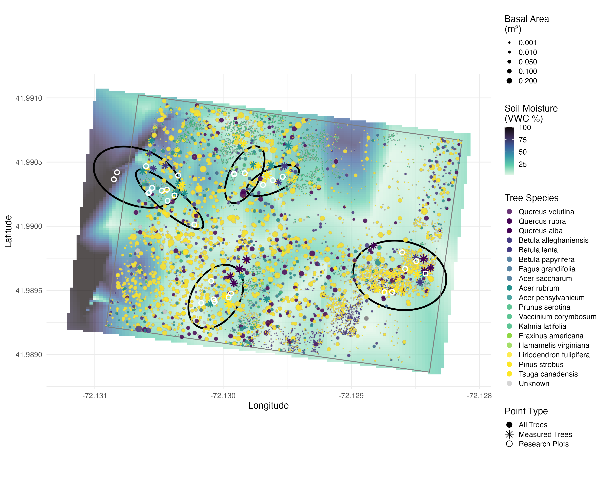

**Figure S1. Study site overview showing tree species composition and soil moisture across the hydrological gradient.** Map of the Yale Myers Forest study area overlaid with interpolated soil volumetric water content (VWC, %) from continuous monitoring. Individual trees from the forest inventory are plotted with point size proportional to basal area (m²) and color indicating species identity. Circled areas delineate the three research plots (Upland, Intermediate, Wetland). Asterisks mark trees measured repeatedly during the 2020–2021 monthly time series. Latitude and longitude axes in decimal degrees.

### Figure S2

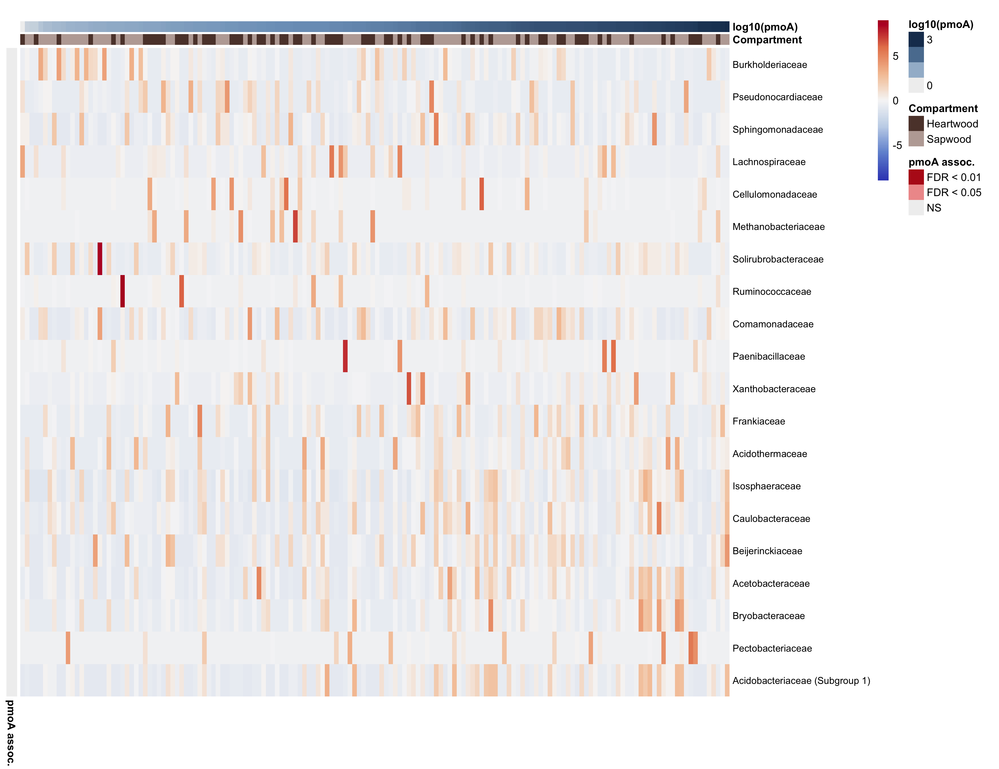

**Figure S2. Family-level 16S rRNA taxonomy associated with pmoA (methanotroph) gene abundance.** Heatmap of row-scaled relative abundance for the top 20 most abundant families plus families with significant pmoA associations (FDR < 0.05). Samples (columns) ordered by pmoA abundance; families (rows) ordered by association t-statistic. Top annotation bars show log₁₀(pmoA) and compartment (Heartwood/Sapwood). Left annotation indicates FDR significance (< 0.01, < 0.05, or NS) from linear mixed-effects models controlling for compartment and total 16S concentration.

### Figure S3

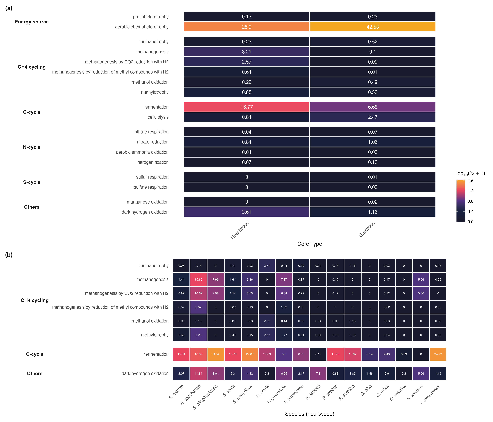

**Figure S3. FAPROTAX functional predictions of microbial metabolisms in tree wood.** (a) Mean relative abundance (log₁₀(% + 1)) of predicted metabolic functions in heartwood vs. sapwood, grouped by functional category: energy source, CH₄ cycling, C-cycle, N-cycle, S-cycle, and others. Values annotated on each cell. (b) Mean relative abundance of selected CH₄-cycling, C-cycle, and other metabolisms across tree species (heartwood samples only).

### Figure S4

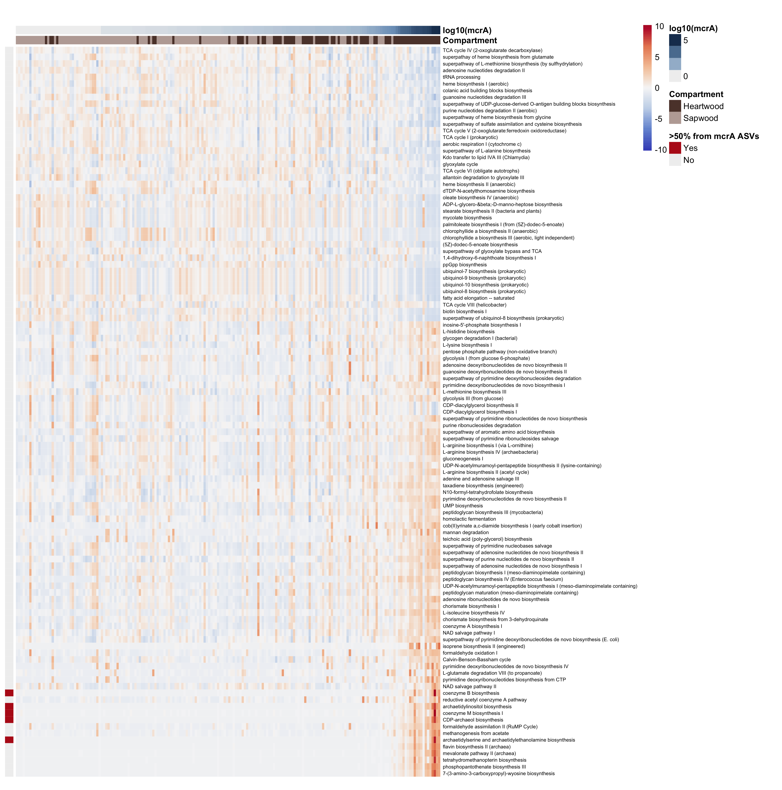

**Figure S4. Complete set of MetaCyc pathways significantly associated with mcrA abundance.** Extended version of Figure 6 showing all MetaCyc pathways with FDR < 0.01 associations with mcrA gene abundance, and retaining methanogen-classified ASVs. Row annotation bar indicates pathways where >50% of predicted abundance derives from methanogen-classified ASVs. Cell borders shown for readability. Samples (columns) ordered by mcrA abundance; pathways (rows) ordered by association t-statistic. Same statistical framework as Figure 6.

### Figure S5

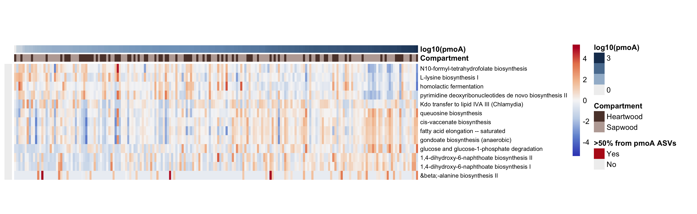

**Figure S5. MetaCyc pathways significantly associated with pmoA (methanotroph) gene abundance.** Heatmap of PICRUSt2-predicted pathway abundances with significant pmoA associations (FDR < 0.01), and retaining methanotroph-classified ASVs. Row annotation bar indicates pathways where >50% of predicted abundance derives from methanotroph-classified ASVs. Cell borders shown for readability. Samples (columns) ordered by pmoA abundance; pathways (rows) ordered by association t-statistic. Layout and statistical methods parallel Figure 6.

### Figure S6

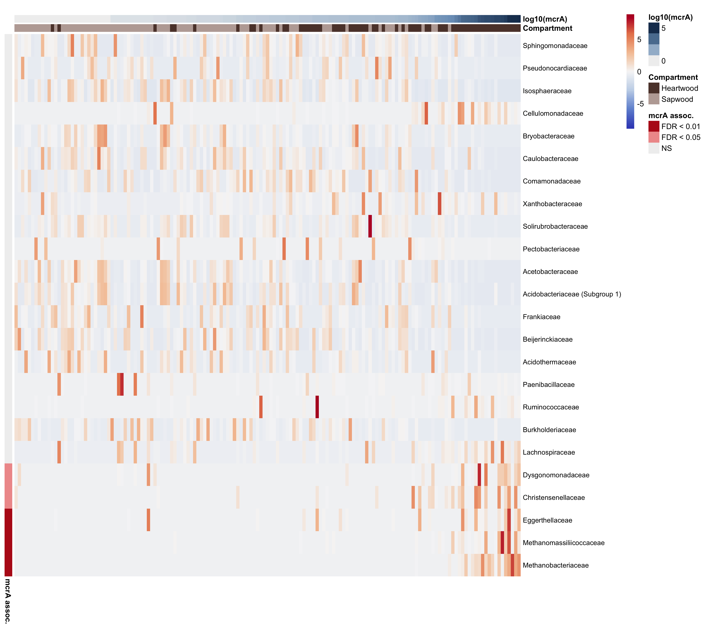

**Figure S6. Family-level 16S rRNA taxonomy associated with mcrA (methanogen) gene abundance.** Heatmap of row-scaled relative abundance for the top 20 most abundant bacterial/archaeal families plus families with significant mcrA associations (FDR < 0.05). Samples (columns) ordered by mcrA abundance; families (rows) ordered by association t-statistic. Top annotation bars show log₁₀(mcrA) and compartment (Heartwood/Sapwood). Left annotation indicates FDR significance (< 0.01, < 0.05, or NS) from linear mixed-effects models controlling for compartment and total 16S concentration.

### Figure S7

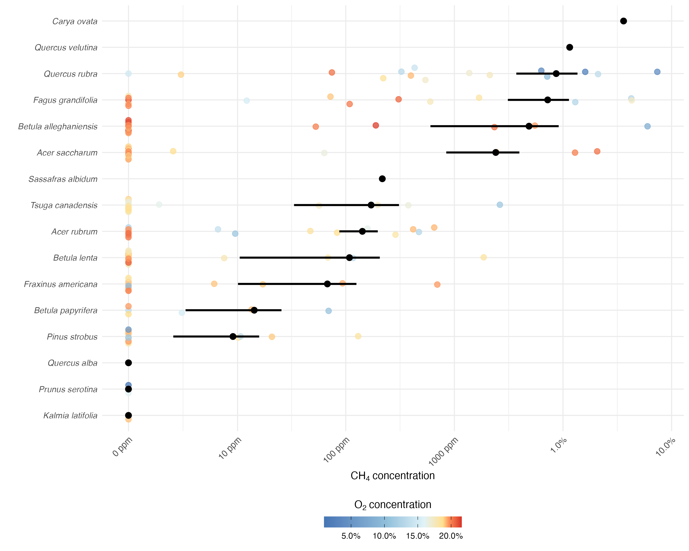

**Figure S7. Internal CH₄ concentrations by tree species.** Distribution of internal stem CH₄ concentrations for 16 tree species, ordered by mean concentration (highest at top). Points colored by internal O₂ concentration (blue = low O₂, red = high O₂). Black points with horizontal bars show species mean ± SE. X-axis uses a pseudo-log₁₀ scale.

### Figure S8

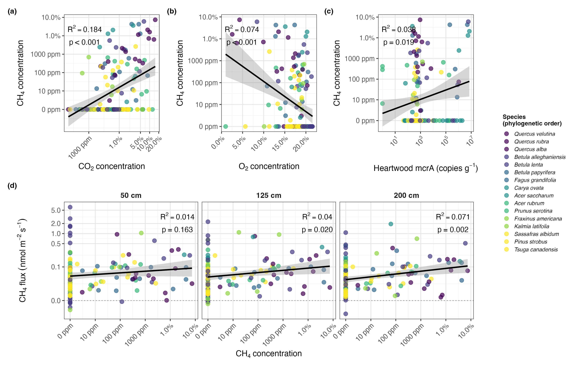

**Figure S8. Relationships between internal gas concentrations, mcrA abundance, and CH₄ flux.** (a) Internal CO₂ vs. CH₄ concentration (pseudo-log₁₀ scaled axes; R² and p-value annotated). (b) Internal O₂ (linear scale, %) vs. CH₄ concentration (pseudo-log₁₀). (c) Heartwood mcrA gene abundance (log₁₀ copies g⁻¹) vs. internal CH₄ concentration. (d) Internal CH₄ concentration vs. stem CH₄ flux (pseudo-log₁₀) at three measurement heights (50, 125, 200 cm), with R² and p-value per panel. Points colored by species in phylogenetic order. Linear regressions with 95% confidence bands shown.

### Figure S9

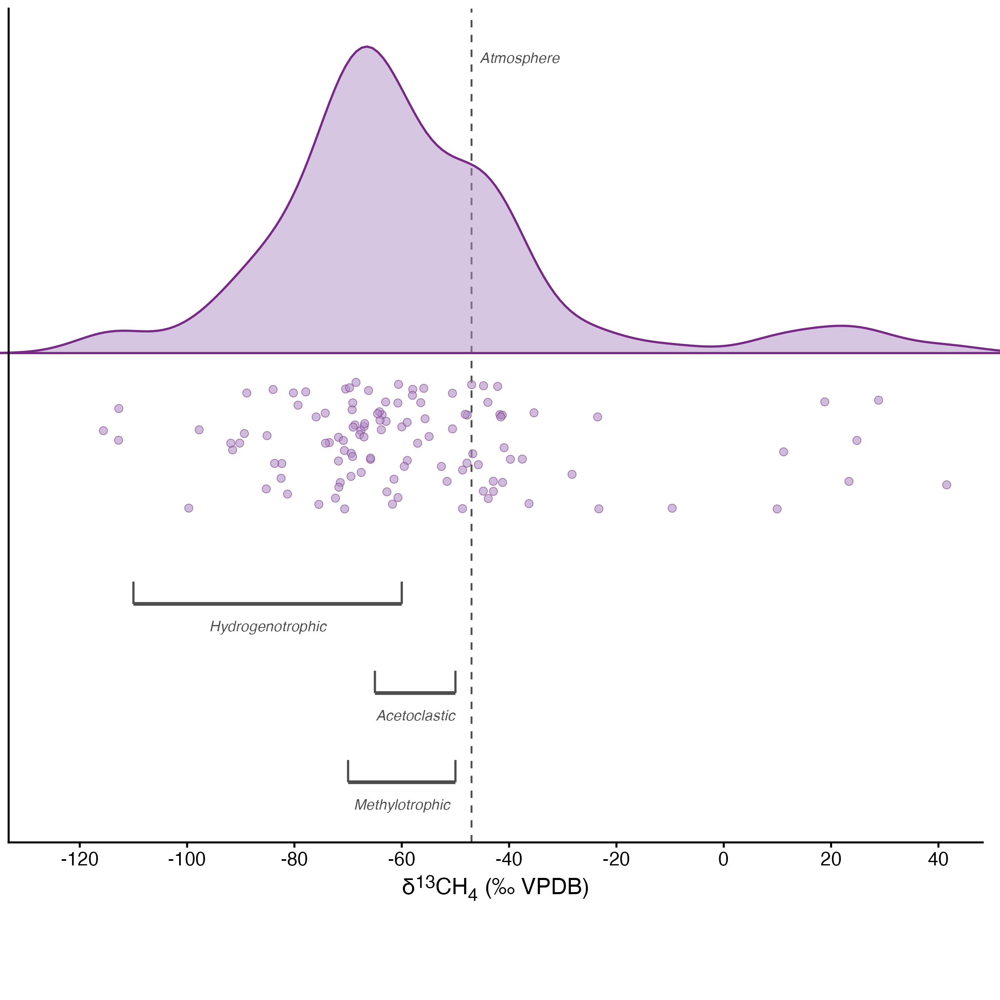

**Figure S9. Stable carbon isotopic composition of tree stem CH₄.** Distribution of δ¹³CH₄ values (‰ VPDB) measured from internal tree stem gas samples. Top: kernel density estimate (filled purple). Bottom: individual measurements as jittered points. Dashed vertical line indicates atmospheric δ¹³CH₄ (~–47‰). Bracket annotations show literature ranges for hydrogenotrophic (–110 to –60‰), acetoclastic (–65 to –50‰), and methylotrophic (–70 to –50‰) methanogenesis.

### Figure S10

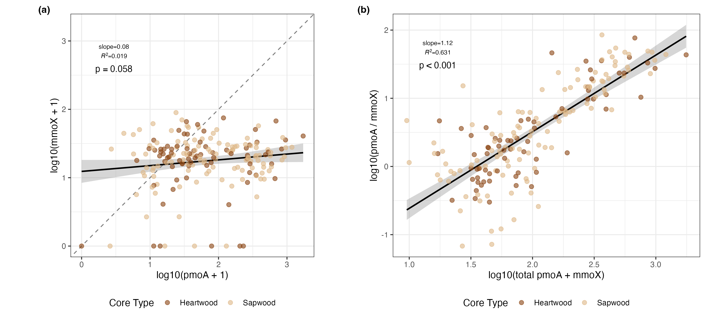

**Figure S10. Relationship between pmoA and mmoX methanotroph gene abundances.** (a) Log₁₀(pmoA + 1) vs. log₁₀(mmoX + 1) for individual wood core samples, colored by core type (Heartwood vs. Sapwood). Dashed line = 1:1 reference; solid line = linear regression. (b) Log₁₀(pmoA/mmoX ratio) vs. log₁₀(total pmoA + mmoX).

### Figure S11

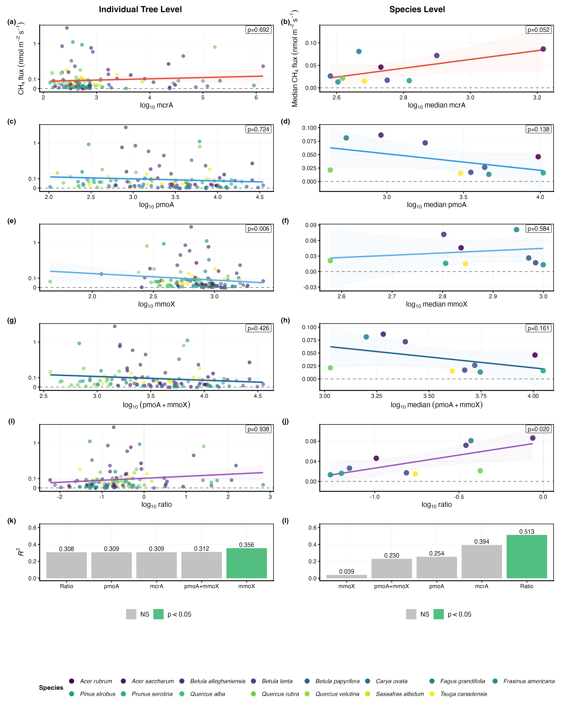

**Figure S11. Scale-dependent relationships between functional gene abundance and CH₄ flux.** Left column: individual tree-level relationships between area-weighted gene abundance and CH₄ flux for (a) mcrA, (c) pmoA, (e) mmoX, (g) pmoA + mmoX, and (i) mcrA:(pmoA + mmoX) ratio. Points colored by species. Right column: corresponding species-level relationships using median gene abundance vs. median CH₄ flux for (b) mcrA, (d) pmoA, (f) mmoX, (h) pmoA + mmoX, and (j) ratio. Error bars show interquartile range. Bottom row: (k) R² values for individual-level models; (l) R² values for species-level models. Green bars indicate significant relationships (p < 0.05).

### Figure S12

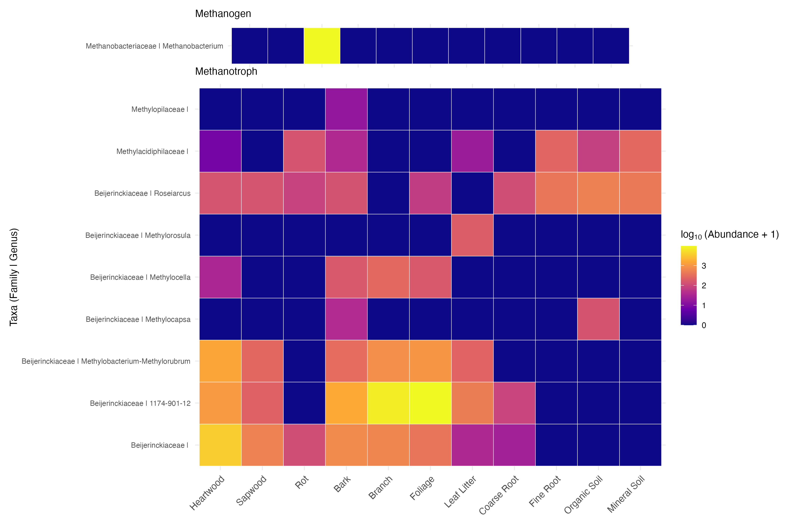

**Figure S12. Distribution of methane-cycling taxa across tissue types in a felled black oak (*Quercus velutina*).** Heatmap of log₁₀(abundance + 1) across tissue types from tree interior to ground. (a) Methanogen taxa. (b) Known methanotroph taxa. (c) Putative methanotroph taxa.

### Figure S13

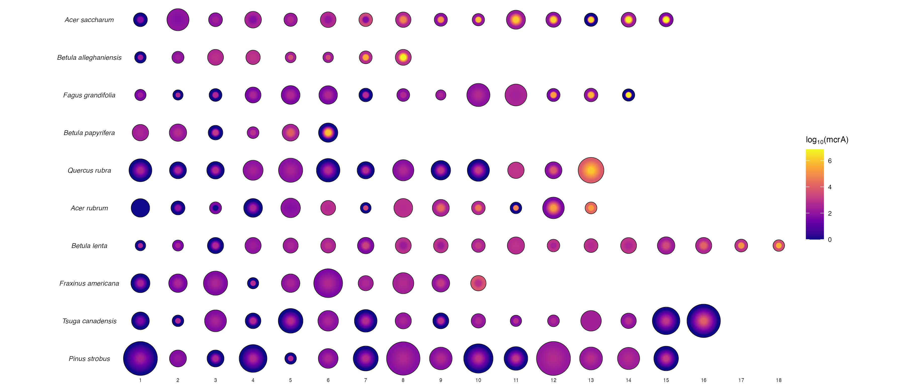

**Figure S13. Radial mcrA distribution across individual trees of 10 species.** Grid of radial cross-section visualizations showing log₁₀(mcrA) distribution within heartwood (center) and sapwood (outer ring). Rows represent species; columns represent individual trees. Circle diameter proportional to DBH.

### Figure S14

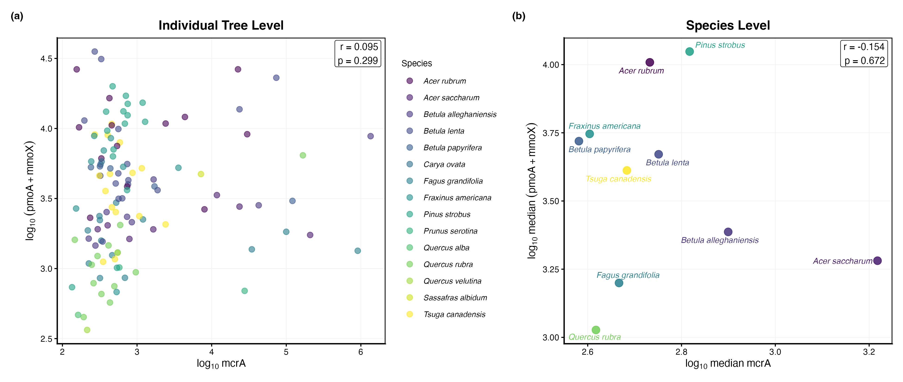

**Figure S14. Independence of methanogen and methanotroph gene abundances.** (a) Individual tree-level mcrA vs. total methanotroph (pmoA + mmoX) gene abundance (log₁₀-transformed; r = 0.095, p = 0.299). (b) Species-level median mcrA vs. median methanotroph abundance (r = -0.154, p = 0.672).

### Figure S15

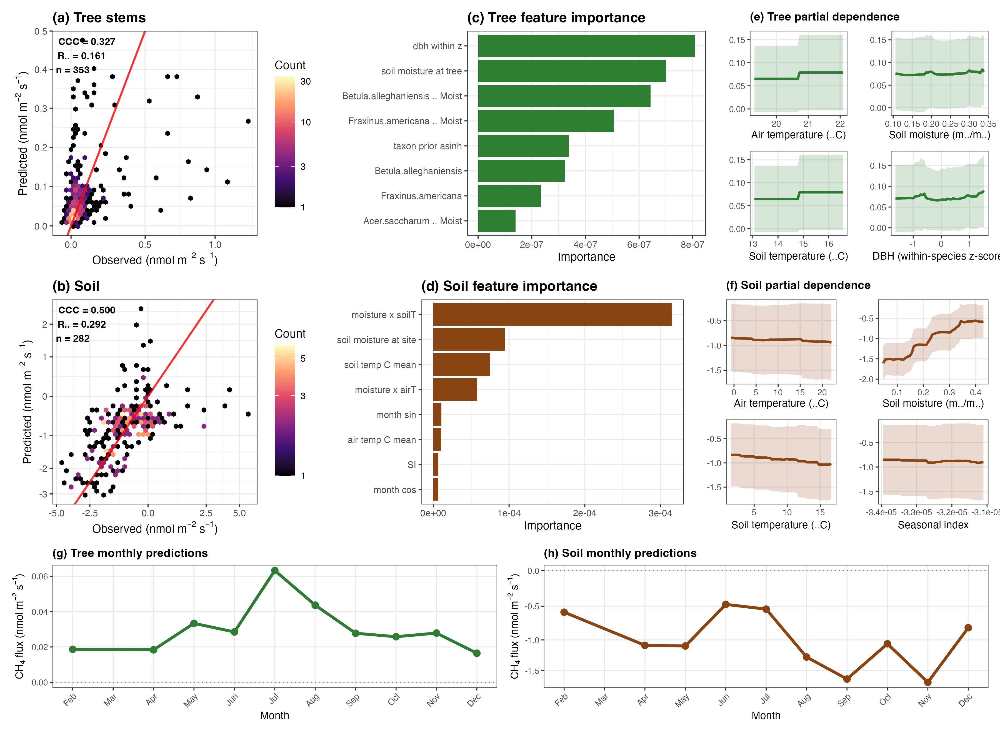

**Figure S15. Random forest model performance and seasonal predictions for tree stem and soil CH₄ fluxes.** (a) Observed vs. predicted tree stem CH₄ flux (pseudo-log₁₀ axes) with concordance correlation coefficient (CCC; Lin 1989), R², and sample size annotated. Red line = 1:1 reference. (b) Observed vs. predicted soil CH₄ flux. (c) Feature importance for the tree stem model. (d) Feature importance for the soil model. (e) Partial dependence plots for top tree predictors (air temperature, soil moisture, soil temperature, DBH), with ±1 SD ribbon. (f) Partial dependence plots for top soil predictors (air temperature, soil moisture, soil temperature, seasonal index). (g) Monthly mean predicted tree stem CH₄ flux (green) with 95% CI. (h) Monthly mean predicted soil CH₄ flux (brown) with 95% CI.

### Figure S16
**Figure S16. Photo of representative semi-rigid chamber used for stem flux measurements during the 2020–2021 monthly time series.**

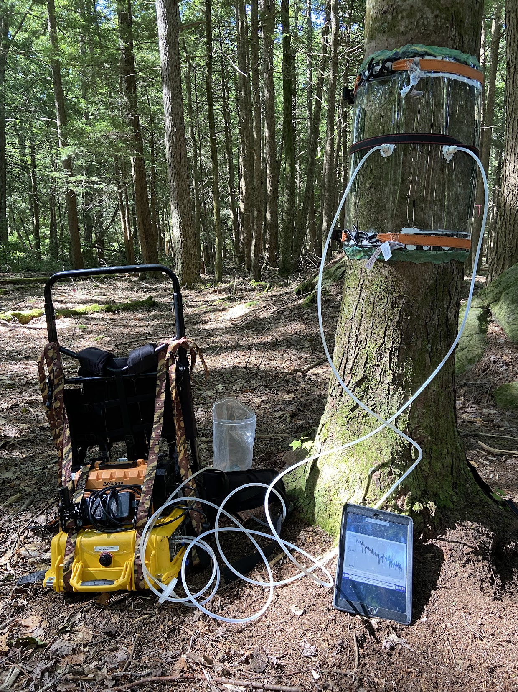

### Figure S17
**Figure S17. Photo of representative rigid chamber used for stem flux measurements during the 2021 intensive survey and 2023 breast-height survey.**

